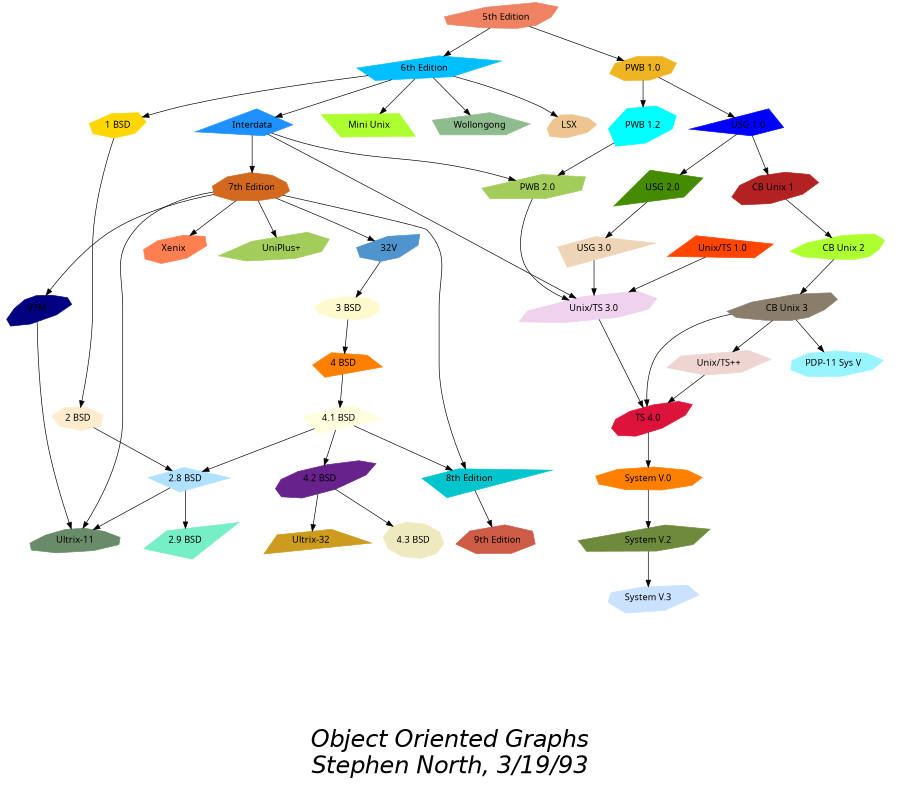
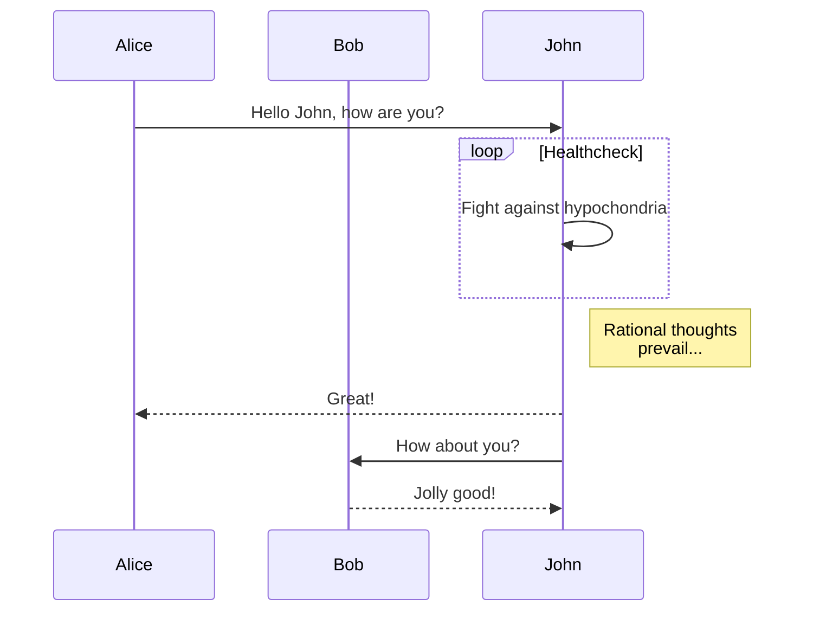
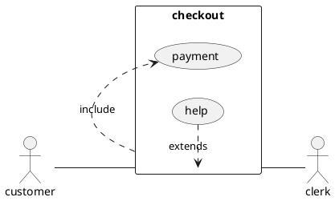
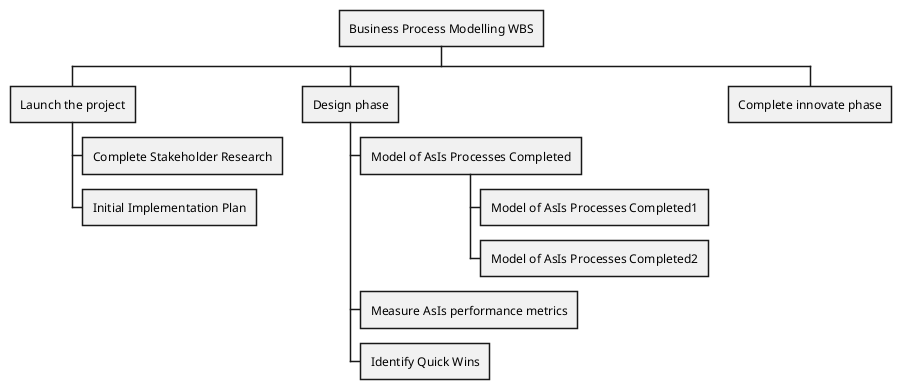
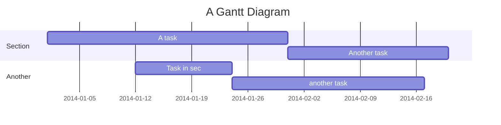
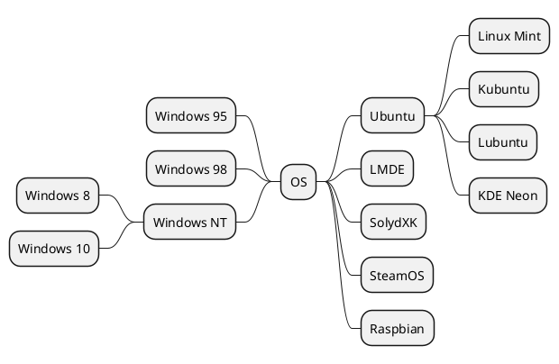

# AIDM Kroki 다이어그램 종류별 렌더링 카탈로그

> [!abstract] 핵심 아이디어
> [kroki.io/examples.html](https://kroki.io/examples.html) 공식 예시 33건의 다이어그램 소스를 본 노트에 펜스 코드블록으로 정리해, **AIDM Quartz 사이트에서 종류별 다이어그램이 어떻게 렌더링되는지를 한 곳에서 확인하는 카탈로그**로 사용한다. 새로운 다이어그램 도구를 노트에 도입하기 전 본 카탈로그에서 시각적 결과·문법 형태를 먼저 비교 검토한다.

> [!info] 환경 전제
> - **Kroki 서버**: 자체 호스팅 `yuzutech/kroki:0.28.0` 본체 + worker 3종(`kroki-mermaid` · `kroki-bpmn` · `kroki-excalidraw`) docker compose 스택
> - **렌더링 경로**: Quartz 빌드 시점에 `KrokiDiagrams` 트랜스포머가 펜스 코드블록을 Kroki HTTP API POST로 전달 → SVG 응답을 인라인 임베드. 클라이언트(브라우저)는 정적 SVG만 렌더.
> - **펜스 컨벤션**: 타입명 단독 펜스. 예: ` ```blockdiag `, ` ```d2 `, ` ```graphviz `, ` ```mermaid `. Quartz 트랜스포머의 30종 화이트리스트(`actdiag` · `blockdiag` · `bpmn` · `bytefield` · `c4plantuml` · `d2` · `dbml` · `diagramsnet` · `ditaa` · `dot` · `erd` · `excalidraw` · `graphviz` · `mermaid` · `nomnoml` · `nwdiag` · `packetdiag` · `pikchr` · `plantuml` · `rackdiag` · `seqdiag` · `structurizr` · `svgbob` · `symbolator` · `tikz` · `umlet` · `vega` · `vegalite` · `wavedrom` · `wireviz`)와 일치
> - **GET URL 임베드 예시는 모두 제외** — POST 본문 + 펜스 코드블록 방식으로 일원화

## 카탈로그 도구 33건

| # | 카테고리 | 도구 | 펜스 타입 | Kroki 처리 |
|---|---------|------|----------|:----------:|
| 01 | Block diagram | BlockDiag | `blockdiag` | 본체 통합 |
| 02 | Sequence diagram | SeqDiag | `seqdiag` | 본체 통합 |
| 03 | Activity diagram | ActDiag | `actdiag` | 본체 통합 |
| 04 | Network diagram | NwDiag | `nwdiag` | 본체 통합 |
| 05 | Packet diagram | PacketDiag | `packetdiag` | 본체 통합 |
| 06 | Rack diagram | RackDiag | `rackdiag` | 본체 통합 |
| 07 | Object Oriented Graph | GraphViz | `graphviz` | 본체 통합 |
| 08 | Commit Graph | Pikchr | `pikchr` | 본체 통합 |
| 09 | Entity Relationship Diagram | Erd | `erd` | 본체 통합 |
| 10 | Hand-drawn like diagrams | Excalidraw | `excalidraw` | **worker (`kroki-excalidraw`)** |
| 11 | Bar Chart | Vega | `vega` | 본체 통합 |
| 12 | Diverging Stacked Bar Chart | Vega-Lite | `vegalite` | 본체 통합 |
| 13 | Conjugate prior relationships | Ditaa | `ditaa` | 본체 통합 |
| 14 | Sequence diagram | Mermaid | `mermaid` | **worker (`kroki-mermaid`)** |
| 15 | UML diagram | Nomnoml | `nomnoml` | 본체 통합 |
| 16 | Use case diagram | PlantUML | `plantuml` | 본체 통합 |
| 17 | Work Breakdown Structure | PlantUML | `plantuml` | 본체 통합 |
| 18 | Gantt | Mermaid | `mermaid` | **worker (`kroki-mermaid`)** |
| 19 | Syntax diagram | Pikchr | `pikchr` | 본체 통합 |
| 20 | Mind Map | PlantUML | `plantuml` | 본체 통합 |
| 21 | BPMN | BPMN | `bpmn` | **worker (`kroki-bpmn`)** |
| 22 | Bytefield | Bytefield | `bytefield` | 본체 통합 |
| 23 | Digital Timing diagram | WaveDrom | `wavedrom` | 본체 통합 |
| 24 | Connected Servers | Svgbob | `svgbob` | 본체 통합 |
| 25 | Ascii Art | Svgbob | `svgbob` | 본체 통합 |
| 26 | Impossible trident | Pikchr | `pikchr` | 본체 통합 |
| 27 | Context diagram | C4 PlantUML | `c4plantuml` | 본체 통합 |
| 28 | Container diagram | C4 PlantUML | `c4plantuml` | 본체 통합 |
| 29 | Container diagram | Structurizr | `structurizr` | 본체 통합 |
| 30 | Component diagram | C4 PlantUML | `c4plantuml` | 본체 통합 |
| 31 | State machine | UMlet | `umlet` | 본체 통합 |
| 32 | Wiring system | WireViz | `wireviz` | 본체 통합 |
| 33 | Hardware structure/behavior | Symbolator | `symbolator` | 본체 통합 |

> [!tip] 본체 통합 vs worker 분리 (2026-05-13 실측)
> Kroki 0.28.0 본체 컨테이너에 내장 빌드된 다이어그램은 27종. 별도 worker 컨테이너 3종이 추가로 필요하다.
> - **본체 통합 27종**: BlockDiag 계열(`blockdiag`·`seqdiag`·`actdiag`·`nwdiag`·`packetdiag`·`rackdiag`) · GraphViz · Pikchr · Erd · Vega · Vega-Lite · Ditaa · Nomnoml · PlantUML(C4 포함) · Bytefield · WaveDrom · Svgbob · UMLet · WireViz · Symbolator · D2 · DBML · Structurizr · TikZ
> - **worker 분리 3종** (`~/Kroki/docker-compose.yml`에 별도 서비스 + `KROKI_<TYPE>_HOST` 환경변수): `yuzutech/kroki-mermaid` · `yuzutech/kroki-bpmn` · `yuzutech/kroki-excalidraw`
> - Mermaid/BPMN/Excalidraw는 본체 컨테이너에 메타데이터만 있고 실제 렌더링은 worker 호출. worker 미가동 시 HTTP 503 반환.

---

## 01. Block diagram — BlockDiag

> [!example] 타입 `blockdiag` · 8줄

```blockdiag
blockdiag {
  blockdiag -> generates -> "block-diagrams";
  blockdiag -> is -> "very easy!";

  blockdiag [color = "greenyellow"];
  "block-diagrams" [color = "pink"];
  "very easy!" [color = "orange"];
}
```

## 02. Sequence diagram — SeqDiag

> [!example] 타입 `seqdiag` · 8줄

```seqdiag
seqdiag {
  browser  -> webserver [label = "GET /index.html"];
  browser <-- webserver;
  browser  -> webserver [label = "POST /blog/comment"];
  webserver  -> database [label = "INSERT comment"];
  webserver <-- database;
  browser <-- webserver;
}
```

## 03. Activity diagram — ActDiag

> [!example] 타입 `actdiag` · 12줄

```actdiag
actdiag {
  write -> convert -> image

  lane user {
    label = "User"
    write [label = "Writing reST"];
    image [label = "Get diagram IMAGE"];
  }
  lane actdiag {
    convert [label = "Convert reST to Image"];
  }
}
```

## 04. Network diagram — NwDiag

> [!example] 타입 `nwdiag` · 16줄

```nwdiag
nwdiag {
  network dmz {
    address = "210.x.x.x/24"

    web01 [address = "210.x.x.1"];
    web02 [address = "210.x.x.2"];
  }
  network internal {
    address = "172.x.x.x/24";

    web01 [address = "172.x.x.1"];
    web02 [address = "172.x.x.2"];
    db01;
    db02;
  }
}
```

## 05. Packet diagram — PacketDiag

> [!example] 타입 `packetdiag` · 24줄

```packetdiag
packetdiag {
  colwidth = 32;
  node_height = 72;

  0-15: Source Port;
  16-31: Destination Port;
  32-63: Sequence Number;
  64-95: Acknowledgment Number;
  96-99: Data Offset;
  100-103: Reserved;
  104: CWR [rotate = 270];
  105: ECE [rotate = 270];
  106: URG [rotate = 270];
  107: ACK [rotate = 270];
  108: PSH [rotate = 270];
  109: RST [rotate = 270];
  110: SYN [rotate = 270];
  111: FIN [rotate = 270];
  112-127: Window;
  128-143: Checksum;
  144-159: Urgent Pointer;
  160-191: (Options and Padding);
  192-223: data [colheight = 3];
}
```

## 06. Rack diagram — RackDiag

> [!example] 타입 `rackdiag` · 10줄

```rackdiag
rackdiag {
  16U;
  1: UPS [2U];
  3: DB Server;
  4: Web Server;
  5: Web Server;
  6: Web Server;
  7: Load Balancer;
  8: L3 Switch;
}
```

## 07. Object Oriented Graph — GraphViz

> [!example] 타입 `graphviz` · 104줄



## 08. Commit Graph — Pikchr

> [!example] 타입 `pikchr` · 60줄

```pikchr
scale = 0.8
fill = white
linewid *= 0.5
circle "C0" fit
circlerad = previous.radius
arrow
circle "C1"
arrow
circle "C2"
arrow
circle "C4"
arrow
circle "C6"
circle "C3" at dist(C2,C4) heading 30 from C2
arrow
circle "C5"
arrow from C2 to C3 chop
C3P: circle "C3'" at dist(C4,C6) heading 30 from C6
arrow right from C3P.e
C5P: circle "C5'"
arrow from C6 to C3P chop

box height C3.y-C2.y \
    width (C5P.e.x-C0.w.x)+linewid \
    with .w at 0.5*linewid west of C0.w \
    behind C0 \
    fill 0xc6e2ff thin color gray
box same width previous.e.x - C2.w.x \
    with .se at previous.ne \
    fill 0x9accfc
"trunk" below at 2nd last box.s
"feature branch" above at last box.n

circle "C0" at 3.7cm south of C0
arrow
circle "C1"
arrow
circle "C2"
arrow
circle "C4"
arrow
circle "C6"
circle "C3" at dist(C2,C4) heading 30 from C2
arrow
circle "C5"
arrow
circle "C7"
arrow from C2 to C3 chop
arrow from C6 to C7 chop

box height C3.y-C2.y \
    width (C7.e.x-C0.w.x)+1.5*C1.radius \
    with .w at 0.5*linewid west of C0.w \
    behind C0 \
    fill 0xc6e2ff thin color gray
box same width previous.e.x - C2.w.x \
    with .se at previous.ne \
    fill 0x9accfc
"trunk" below at 2nd last box.s
"feature branch" above at last box.n
```

## 09. Entity Relationship Diagram — Erd

> [!example] 타입 `erd` · 13줄

```erd
[Person]
*name
height
weight
+birth_location_id

[Location]
*id
city
state
country

Person *--1 Location
```

## 10. Hand-drawn like diagrams — Excalidraw

> [!example] 타입 `excalidraw` · 695줄

```excalidraw
{
  "type": "excalidraw",
  "version": 2,
  "source": "https://excalidraw.com",
  "elements": [
    {
      "type": "rectangle",
      "version": 175,
      "versionNonce": 279344008,
      "isDeleted": false,
      "id": "2ZYh24ed28FJ0yE-S3YNY",
      "fillStyle": "hachure",
      "strokeWidth": 1,
      "strokeStyle": "solid",
      "roughness": 1,
      "opacity": 100,
      "angle": 0,
      "x": 580,
      "y": 140,
      "strokeColor": "#000000",
      "backgroundColor": "#15aabf",
      "width": 80,
      "height": 19.999999999999996,
      "seed": 521916552,
      "groupIds": [],
      "strokeSharpness": "sharp",
      "boundElementIds": [
        "Be1y2yzhV3Zd4nwCro__8"
      ]
    },
    {
      "type": "rectangle",
      "version": 180,
      "versionNonce": 164784376,
      "isDeleted": false,
      "id": "bO0OVt6m7LowYpq22ePCA",
      "fillStyle": "hachure",
      "strokeWidth": 1,
      "strokeStyle": "solid",
      "roughness": 1,
      "opacity": 100,
      "angle": 0,
      "x": 660,
      "y": 140,
      "strokeColor": "#000000",
      "backgroundColor": "#4c6ef5",
      "width": 120,
      "height": 19.999999999999996,
      "seed": 1303206904,
      "groupIds": [],
      "strokeSharpness": "sharp",
      "boundElementIds": [
        "KaCO9-QjUenSyCuuanoTo"
      ]
    },
    {
      "type": "rectangle",
      "version": 183,
      "versionNonce": 27181704,
      "isDeleted": false,
      "id": "jz0Huq9-s6pNxDw0RqHcR",
      "fillStyle": "hachure",
      "strokeWidth": 1,
      "strokeStyle": "solid",
      "roughness": 1,
      "opacity": 100,
      "angle": 0,
      "x": 780,
      "y": 140,
      "strokeColor": "#000000",
      "backgroundColor": "#fab005",
      "width": 180,
      "height": 19.999999999999996,
      "seed": 861962120,
      "groupIds": [],
      "strokeSharpness": "sharp",
      "boundElementIds": [
        "74ifmqmu0vN0NK0_0FwPm"
      ]
    },
    {
      "type": "rectangle",
      "version": 192,
      "versionNonce": 2123008504,
      "isDeleted": false,
      "id": "UnmNTmwJtm6moubcGtSgB",
      "fillStyle": "hachure",
      "strokeWidth": 1,
      "strokeStyle": "solid",
      "roughness": 1,
      "opacity": 100,
      "angle": 0,
      "x": 960,
      "y": 140,
      "strokeColor": "#000000",
      "backgroundColor": "#fa5252",
      "width": 80,
      "height": 19.999999999999996,
      "seed": 277814520,
      "groupIds": [],
      "strokeSharpness": "sharp",
      "boundElementIds": [
        "1v60NED2criGG-wo9-oQL"
      ]
    },
    {
      "type": "rectangle",
      "version": 202,
      "versionNonce": 1823814024,
      "isDeleted": false,
      "id": "of76J4WOJHnHi0L61Vst_",
      "fillStyle": "hachure",
      "strokeWidth": 1,
      "strokeStyle": "solid",
      "roughness": 1,
      "opacity": 100,
      "angle": 0,
      "x": 1040,
      "y": 140,
      "strokeColor": "#000000",
      "backgroundColor": "#be4bdb",
      "width": 180,
      "height": 19.999999999999996,
      "seed": 1496796808,
      "groupIds": [],
      "strokeSharpness": "sharp",
      "boundElementIds": [
        "jjuPzyRneMv3f65lps_6a"
      ]
    },
    {
      "type": "rectangle",
      "version": 193,
      "versionNonce": 1234602744,
      "isDeleted": false,
      "id": "SlvbjeV-9lXbcrlKib-hj",
      "fillStyle": "hachure",
      "strokeWidth": 1,
      "strokeStyle": "solid",
      "roughness": 1,
      "opacity": 100,
      "angle": 0,
      "x": 1220,
      "y": 140,
      "strokeColor": "#000000",
      "backgroundColor": "#868e96",
      "width": 60,
      "height": 19.999999999999996,
      "seed": 1938865656,
      "groupIds": [],
      "strokeSharpness": "sharp",
      "boundElementIds": [
        "5QQzhw_uqk_rBaW2wMriT"
      ]
    },
    {
      "type": "text",
      "version": 81,
      "versionNonce": 1188901129,
      "isDeleted": false,
      "id": "vrdt3JfbD2Xwz4K4TWScI",
      "fillStyle": "hachure",
      "strokeWidth": 1,
      "strokeStyle": "solid",
      "roughness": 1,
      "opacity": 100,
      "angle": 0,
      "x": 840,
      "y": -60,
      "strokeColor": "#000000",
      "backgroundColor": "#868e96",
      "width": 190,
      "height": 45,
      "seed": 1499217288,
      "groupIds": [],
      "strokeSharpness": "sharp",
      "boundElementIds": [],
      "fontSize": 36,
      "fontFamily": 1,
      "text": "JavaScript",
      "baseline": 32,
      "textAlign": "left",
      "verticalAlign": "top"
    },
    {
      "type": "arrow",
      "version": 343,
      "versionNonce": 1369065096,
      "isDeleted": false,
      "id": "Be1y2yzhV3Zd4nwCro__8",
      "fillStyle": "hachure",
      "strokeWidth": 1,
      "strokeStyle": "solid",
      "roughness": 1,
      "opacity": 100,
      "angle": 0,
      "x": 597.5075333823274,
      "y": 299,
      "strokeColor": "#000000",
      "backgroundColor": "#868e96",
      "width": 40,
      "height": 139,
      "seed": 666255096,
      "groupIds": [],
      "strokeSharpness": "round",
      "boundElementIds": [],
      "startBinding": {
        "focus": -0.41953339688473495,
        "gap": 1,
        "elementId": "UxgtvUBaIPnDWJZ9kUQH8"
      },
      "endBinding": {
        "focus": -0.11111111111111113,
        "gap": 1,
        "elementId": "2ZYh24ed28FJ0yE-S3YNY"
      },
      "points": [
        [
          0,
          0
        ],
        [
          -17.507533382327438,
          -59
        ],
        [
          22.492466617672562,
          -139
        ]
      ],
      "lastCommittedPoint": null,
      "startArrowhead": null,
      "endArrowhead": "arrow"
    },
    {
      "type": "text",
      "version": 81,
      "versionNonce": 690339976,
      "isDeleted": false,
      "id": "UxgtvUBaIPnDWJZ9kUQH8",
      "fillStyle": "hachure",
      "strokeWidth": 1,
      "strokeStyle": "solid",
      "roughness": 1,
      "opacity": 100,
      "angle": 0,
      "x": 580,
      "y": 300,
      "strokeColor": "#000000",
      "backgroundColor": "#868e96",
      "width": 94,
      "height": 45,
      "seed": 84626568,
      "groupIds": [],
      "strokeSharpness": "sharp",
      "boundElementIds": [
        "Be1y2yzhV3Zd4nwCro__8"
      ],
      "fontSize": 36,
      "fontFamily": 1,
      "text": "Fetch",
      "baseline": 32,
      "textAlign": "left",
      "verticalAlign": "top"
    },
    {
      "type": "rectangle",
      "version": 60,
      "versionNonce": 897215480,
      "isDeleted": false,
      "id": "-Lq0agjWQ31TR_Av5Z4HW",
      "fillStyle": "hachure",
      "strokeWidth": 1,
      "strokeStyle": "solid",
      "roughness": 1,
      "opacity": 100,
      "angle": 0,
      "x": 520,
      "y": -60,
      "strokeColor": "#000000",
      "backgroundColor": "transparent",
      "width": 820,
      "height": 540,
      "seed": 495165432,
      "groupIds": [],
      "strokeSharpness": "sharp",
      "boundElementIds": [
        "jjuPzyRneMv3f65lps_6a"
      ]
    },
    {
      "type": "arrow",
      "version": 537,
      "versionNonce": 1626949112,
      "isDeleted": false,
      "id": "KaCO9-QjUenSyCuuanoTo",
      "fillStyle": "hachure",
      "strokeWidth": 1,
      "strokeStyle": "solid",
      "roughness": 1,
      "opacity": 100,
      "angle": 0,
      "x": 721.0588599991052,
      "y": 60.17790458606555,
      "strokeColor": "#000000",
      "backgroundColor": "#868e96",
      "width": 1.0588599991051524,
      "height": 79.82209541393445,
      "seed": 637565832,
      "groupIds": [],
      "strokeSharpness": "round",
      "boundElementIds": [],
      "startBinding": null,
      "endBinding": {
        "focus": 0,
        "gap": 1,
        "elementId": "bO0OVt6m7LowYpq22ePCA"
      },
      "points": [
        [
          0,
          0
        ],
        [
          -1.0588599991051524,
          39.82209541393445
        ],
        [
          -1.0588599991051524,
          79.82209541393445
        ]
      ],
      "lastCommittedPoint": null,
      "startArrowhead": null,
      "endArrowhead": "arrow"
    },
    {
      "type": "text",
      "version": 112,
      "versionNonce": 358083143,
      "isDeleted": false,
      "id": "4hEOdlcwK6AHyVhjc-MXS",
      "fillStyle": "hachure",
      "strokeWidth": 1,
      "strokeStyle": "solid",
      "roughness": 1,
      "opacity": 100,
      "angle": 0,
      "x": 660,
      "y": 20,
      "strokeColor": "#000000",
      "backgroundColor": "#868e96",
      "width": 103,
      "height": 45,
      "seed": 352116984,
      "groupIds": [],
      "strokeSharpness": "sharp",
      "boundElementIds": [],
      "fontSize": 36,
      "fontFamily": 1,
      "text": "Parse",
      "baseline": 32,
      "textAlign": "left",
      "verticalAlign": "top"
    },
    {
      "type": "arrow",
      "version": 534,
      "versionNonce": 983577992,
      "isDeleted": false,
      "id": "74ifmqmu0vN0NK0_0FwPm",
      "fillStyle": "hachure",
      "strokeWidth": 1,
      "strokeStyle": "solid",
      "roughness": 1,
      "opacity": 100,
      "angle": 0,
      "x": 841.6574209245741,
      "y": 219,
      "strokeColor": "#000000",
      "backgroundColor": "#868e96",
      "width": 43.15128973100309,
      "height": 59.174989629909305,
      "seed": 1853344392,
      "groupIds": [],
      "strokeSharpness": "round",
      "boundElementIds": [],
      "startBinding": {
        "focus": 0.09211398277003865,
        "gap": 1,
        "elementId": "K4so-arfr0JX0NJx8vd7T"
      },
      "endBinding": {
        "focus": -0.2163077865936296,
        "gap": 1,
        "elementId": "jz0Huq9-s6pNxDw0RqHcR"
      },
      "points": [
        [
          0,
          0
        ],
        [
          -1.6574209245741258,
          1
        ],
        [
          41.493868806428964,
          -58.174989629909305
        ]
      ],
      "lastCommittedPoint": null,
      "startArrowhead": null,
      "endArrowhead": "arrow"
    },
    {
      "type": "text",
      "version": 118,
      "versionNonce": 1185705864,
      "isDeleted": false,
      "id": "K4so-arfr0JX0NJx8vd7T",
      "fillStyle": "hachure",
      "strokeWidth": 1,
      "strokeStyle": "solid",
      "roughness": 1,
      "opacity": 100,
      "angle": 0,
      "x": 640,
      "y": 220,
      "strokeColor": "#000000",
      "backgroundColor": "#868e96",
      "width": 366,
      "height": 45,
      "seed": 765854200,
      "groupIds": [],
      "strokeSharpness": "sharp",
      "boundElementIds": [
        "74ifmqmu0vN0NK0_0FwPm"
      ],
      "fontSize": 36,
      "fontFamily": 1,
      "text": "Compile and Optimize",
      "baseline": 32,
      "textAlign": "left",
      "verticalAlign": "top"
    },
    {
      "type": "arrow",
      "version": 791,
      "versionNonce": 1724761848,
      "isDeleted": false,
      "id": "1v60NED2criGG-wo9-oQL",
      "fillStyle": "hachure",
      "strokeWidth": 1,
      "strokeStyle": "solid",
      "roughness": 1,
      "opacity": 100,
      "angle": 0,
      "x": 960,
      "y": 320,
      "strokeColor": "#000000",
      "backgroundColor": "#868e96",
      "width": 80,
      "height": 160,
      "seed": 1764571528,
      "groupIds": [],
      "strokeSharpness": "round",
      "boundElementIds": [],
      "startBinding": {
        "focus": -0.1637630662020906,
        "gap": 1,
        "elementId": "dviXudWNxiHYQMZfqHWsH"
      },
      "endBinding": {
        "focus": 0.07692307692307691,
        "gap": 1,
        "elementId": "UnmNTmwJtm6moubcGtSgB"
      },
      "points": [
        [
          0,
          0
        ],
        [
          80,
          -40
        ],
        [
          40,
          -160
        ]
      ],
      "lastCommittedPoint": null,
      "startArrowhead": null,
      "endArrowhead": "arrow"
    },
    {
      "type": "text",
      "version": 194,
      "versionNonce": 473574648,
      "isDeleted": false,
      "id": "dviXudWNxiHYQMZfqHWsH",
      "fillStyle": "hachure",
      "strokeWidth": 1,
      "strokeStyle": "solid",
      "roughness": 1,
      "opacity": 100,
      "angle": 0,
      "x": 720,
      "y": 320,
      "strokeColor": "#000000",
      "backgroundColor": "#868e96",
      "width": 484,
      "height": 45,
      "seed": 1988297464,
      "groupIds": [],
      "strokeSharpness": "sharp",
      "boundElementIds": [
        "1v60NED2criGG-wo9-oQL"
      ],
      "fontSize": 36,
      "fontFamily": 1,
      "text": "Re-optimize and Deoptimize",
      "baseline": 32,
      "textAlign": "left",
      "verticalAlign": "top"
    },
    {
      "type": "arrow",
      "version": 708,
      "versionNonce": 185615496,
      "isDeleted": false,
      "id": "jjuPzyRneMv3f65lps_6a",
      "fillStyle": "hachure",
      "strokeWidth": 1,
      "strokeStyle": "solid",
      "roughness": 1,
      "opacity": 100,
      "angle": 0,
      "x": 1140,
      "y": 80,
      "strokeColor": "#000000",
      "backgroundColor": "#868e96",
      "width": 20,
      "height": 60,
      "seed": 1767688328,
      "groupIds": [],
      "strokeSharpness": "round",
      "boundElementIds": [],
      "startBinding": {
        "focus": -0.3021784319542362,
        "gap": 14.800415739789742,
        "elementId": "qhkjvI1VmWZdnKvU5QKZK"
      },
      "endBinding": {
        "focus": 0.15789473684210528,
        "gap": 1,
        "elementId": "of76J4WOJHnHi0L61Vst_"
      },
      "points": [
        [
          0,
          0
        ],
        [
          -20,
          20
        ],
        [
          0,
          60
        ]
      ],
      "lastCommittedPoint": null,
      "startArrowhead": null,
      "endArrowhead": "arrow"
    },
    {
      "type": "text",
      "version": 213,
      "versionNonce": 2105884296,
      "isDeleted": false,
      "id": "qhkjvI1VmWZdnKvU5QKZK",
      "fillStyle": "hachure",
      "strokeWidth": 1,
      "strokeStyle": "solid",
      "roughness": 1,
      "opacity": 100,
      "angle": 0,
      "x": 1080,
      "y": 20.19958426021026,
      "strokeColor": "#000000",
      "backgroundColor": "#868e96",
      "width": 139,
      "height": 45,
      "seed": 2115494904,
      "groupIds": [],
      "strokeSharpness": "sharp",
      "boundElementIds": [
        "jjuPzyRneMv3f65lps_6a"
      ],
      "fontSize": 36,
      "fontFamily": 1,
      "text": "Execute",
      "baseline": 32,
      "textAlign": "left",
      "verticalAlign": "top"
    },
    {
      "type": "arrow",
      "version": 707,
      "versionNonce": 543827960,
      "isDeleted": false,
      "id": "5QQzhw_uqk_rBaW2wMriT",
      "fillStyle": "hachure",
      "strokeWidth": 1,
      "strokeStyle": "solid",
      "roughness": 1,
      "opacity": 100,
      "angle": 0,
      "x": 1220,
      "y": 240,
      "strokeColor": "#000000",
      "backgroundColor": "#868e96",
      "width": 20,
      "height": 80,
      "seed": 2059564936,
      "groupIds": [],
      "strokeSharpness": "round",
      "boundElementIds": [],
      "startBinding": {
        "focus": 0.7391304347826086,
        "gap": 2,
        "elementId": "C6fyzTg2FHAmrRYfC_THm"
      },
      "endBinding": {
        "focus": 0.3333333333333333,
        "gap": 1,
        "elementId": "SlvbjeV-9lXbcrlKib-hj"
      },
      "points": [
        [
          0,
          0
        ],
        [
          20,
          -40
        ],
        [
          20,
          -80
        ]
      ],
      "lastCommittedPoint": null,
      "startArrowhead": null,
      "endArrowhead": "arrow"
    },
    {
      "type": "text",
      "version": 227,
      "versionNonce": 2002374136,
      "isDeleted": false,
      "id": "C6fyzTg2FHAmrRYfC_THm",
      "fillStyle": "hachure",
      "strokeWidth": 1,
      "strokeStyle": "solid",
      "roughness": 1,
      "opacity": 100,
      "angle": 0,
      "x": 1160,
      "y": 220,
      "strokeColor": "#000000",
      "backgroundColor": "#868e96",
      "width": 58,
      "height": 45,
      "seed": 1651025144,
      "groupIds": [],
      "strokeSharpness": "sharp",
      "boundElementIds": [
        "5QQzhw_uqk_rBaW2wMriT"
      ],
      "fontSize": 36,
      "fontFamily": 1,
      "text": "GC",
      "baseline": 32,
      "textAlign": "left",
      "verticalAlign": "top"
    }
  ],
  "appState": {
    "viewBackgroundColor": "#ffffff",
    "gridSize": 20
  }
}
```

## 11. Bar Chart — Vega

> [!example] 타입 `vega` · 50줄 · kroki.io 원본 Word Cloud는 헤드리스 렌더에서 미동작(M-06) → Vega 공식 단순 막대 차트 예시로 교체

> [!warning] 정적 렌더 미동작 도구를 카탈로그에 포함할 때
> kroki.io 원본 `vega` 예시는 Word Cloud(`wordcloud` transform)로 **클라이언트 JS 실행에 의존**한다. 본 카탈로그의 `KrokiDiagrams` 트랜스포머는 **빌드 시점 정적 SVG 임베드** 방식이므로 동적 transform이 동작하지 않아 모든 단어가 (0,0) 좌표·0px 폰트로 떨어져 빈 화면이 된다. 카탈로그 시연 목적상 정적 렌더 호환 단순 막대 차트로 교체했다(상세는 §호환성 메모 M-06). Word Cloud 원본을 보존하려면 별도 클라이언트 JS 렌더 트랜스포머(`vega-embed` 패턴) 도입 필요.

```vega
{
  "$schema": "https://vega.github.io/schema/vega/v5.json",
  "width": 400,
  "height": 200,
  "padding": 5,
  "data": [
    {
      "name": "table",
      "values": [
        {"category": "A", "amount": 28},
        {"category": "B", "amount": 55},
        {"category": "C", "amount": 43},
        {"category": "D", "amount": 91},
        {"category": "E", "amount": 81},
        {"category": "F", "amount": 53},
        {"category": "G", "amount": 19},
        {"category": "H", "amount": 87}
      ]
    }
  ],
  "scales": [
    {
      "name": "xscale",
      "type": "band",
      "domain": {"data": "table", "field": "category"},
      "range": "width",
      "padding": 0.05
    },
    {
      "name": "yscale",
      "domain": {"data": "table", "field": "amount"},
      "nice": true,
      "range": "height"
    }
  ],
  "axes": [
    {"orient": "bottom", "scale": "xscale"},
    {"orient": "left", "scale": "yscale"}
  ],
  "marks": [
    {
      "type": "rect",
      "from": {"data": "table"},
      "encode": {
        "enter": {
          "x": {"scale": "xscale", "field": "category"},
          "width": {"scale": "xscale", "band": 1},
          "y": {"scale": "yscale", "field": "amount"},
          "y2": {"scale": "yscale", "value": 0},
          "fill": {"value": "steelblue"}
        }
      }
    }
  ]
}
```

## 12. Diverging Stacked Bar Chart — Vega-Lite

> [!example] 타입 `vegalite` · 105줄

```vegalite
{
  "$schema": "https://vega.github.io/schema/vega-lite/v4.json",
  "description": "A diverging stacked bar chart for sentiments towards a set of eight questions, displayed as percentages with neutral responses straddling the 0% mark",
  "data": {
    "values": [
      {"question": "Question 1", "type": "Strongly disagree", "value": 24, "percentage": 0.7},
      {"question": "Question 1", "type": "Disagree", "value": 294, "percentage": 9.1},
      {"question": "Question 1", "type": "Neither agree nor disagree", "value": 594, "percentage": 18.5},
      {"question": "Question 1", "type": "Agree", "value": 1927, "percentage": 59.9},
      {"question": "Question 1", "type": "Strongly agree", "value": 376, "percentage": 11.7},
      {"question": "Question 2", "type": "Strongly disagree", "value": 2, "percentage": 18.2},
      {"question": "Question 2", "type": "Disagree", "value": 2, "percentage": 18.2},
      {"question": "Question 2", "type": "Neither agree nor disagree", "value": 0, "percentage": 0},
      {"question": "Question 2", "type": "Agree", "value": 7, "percentage": 63.6},
      {"question": "Question 2", "type": "Strongly agree", "value": 11, "percentage": 0},
      {"question": "Question 3", "type": "Strongly disagree", "value": 2, "percentage": 20},
      {"question": "Question 3", "type": "Disagree", "value": 0, "percentage": 0},
      {"question": "Question 3", "type": "Neither agree nor disagree", "value": 2, "percentage": 20},
      {"question": "Question 3", "type": "Agree", "value": 4, "percentage": 40},
      {"question": "Question 3", "type": "Strongly agree", "value": 2, "percentage": 20},
      {"question": "Question 4", "type": "Strongly disagree", "value": 0, "percentage": 0},
      {"question": "Question 4", "type": "Disagree", "value": 2, "percentage": 12.5},
      {"question": "Question 4", "type": "Neither agree nor disagree", "value": 1, "percentage": 6.3},
      {"question": "Question 4", "type": "Agree", "value": 7, "percentage": 43.8},
      {"question": "Question 4", "type": "Strongly agree", "value": 6, "percentage": 37.5},
      {"question": "Question 5", "type": "Strongly disagree", "value": 0, "percentage": 0},
      {"question": "Question 5", "type": "Disagree", "value": 1, "percentage": 4.2},
      {"question": "Question 5", "type": "Neither agree nor disagree", "value": 3, "percentage": 12.5},
      {"question": "Question 5", "type": "Agree", "value": 16, "percentage": 66.7},
      {"question": "Question 5", "type": "Strongly agree", "value": 4, "percentage": 16.7},
      {"question": "Question 6", "type": "Strongly disagree", "value": 1, "percentage": 6.3},
      {"question": "Question 6", "type": "Disagree", "value": 1, "percentage": 6.3},
      {"question": "Question 6", "type": "Neither agree nor disagree", "value": 2, "percentage": 12.5},
      {"question": "Question 6", "type": "Agree", "value": 9, "percentage": 56.3},
      {"question": "Question 6", "type": "Strongly agree", "value": 3, "percentage": 18.8},
      {"question": "Question 7", "type": "Strongly disagree", "value": 0, "percentage": 0},
      {"question": "Question 7", "type": "Disagree", "value": 0, "percentage": 0},
      {"question": "Question 7", "type": "Neither agree nor disagree", "value": 1, "percentage": 20},
      {"question": "Question 7", "type": "Agree", "value": 4, "percentage": 80},
      {"question": "Question 7", "type": "Strongly agree", "value": 0, "percentage": 0},
      {"question": "Question 8", "type": "Strongly disagree", "value": 0, "percentage": 0},
      {"question": "Question 8", "type": "Disagree", "value": 0, "percentage": 0},
      {"question": "Question 8", "type": "Neither agree nor disagree", "value": 0, "percentage": 0},
      {"question": "Question 8", "type": "Agree", "value": 0, "percentage": 0},
      {"question": "Question 8", "type": "Strongly agree", "value": 2, "percentage": 100}
    ]
  },
  "transform": [
    {
      "calculate": "if(datum.type === 'Strongly disagree',-2,0) + if(datum.type==='Disagree',-1,0) + if(datum.type =='Neither agree nor disagree',0,0) + if(datum.type ==='Agree',1,0) + if(datum.type ==='Strongly agree',2,0)",
      "as": "q_order"
    },
    {
      "calculate": "if(datum.type === 'Disagree' || datum.type === 'Strongly disagree', datum.percentage,0) + if(datum.type === 'Neither agree nor disagree', datum.percentage / 2,0)",
      "as": "signed_percentage"
    },
    {"stack": "percentage", "as": ["v1", "v2"], "groupby": ["question"]},
    {
      "joinaggregate": [
        {
          "field": "signed_percentage",
          "op": "sum",
          "as": "offset"
        }
      ],
      "groupby": ["question"]
    },
    {"calculate": "datum.v1 - datum.offset", "as": "nx"},
    {"calculate": "datum.v2 - datum.offset", "as": "nx2"}
  ],
  "mark": "bar",
  "encoding": {
    "x": {
      "field": "nx",
      "type": "quantitative",
      "axis": {
        "title": "Percentage"
      }
    },
    "x2": {"field": "nx2"},
    "y": {
      "field": "question",
      "type": "nominal",
      "axis": {
        "title": "Question",
        "offset": 5,
        "ticks": false,
        "minExtent": 60,
        "domain": false
      }
    },
    "color": {
      "field": "type",
      "type": "nominal",
      "legend": {
        "title": "Response"
      },
      "scale": {
        "domain": ["Strongly disagree", "Disagree", "Neither agree nor disagree", "Agree", "Strongly agree"],
        "range": ["#c30d24", "#f3a583", "#cccccc", "#94c6da", "#1770ab"],
        "type": "ordinal"
      }
    }
  }
}
```

## 13. Conjugate prior relationships — Ditaa

> [!example] 타입 `ditaa` · 24줄

```ditaa
+-------------+
                          |             |
                          | Exponential |
                          |             |
                          +-------------+
                                 |
                          lambda |
                                 v
+-------------+           +-------------+           +-------------+
|             |   tau     |             |   lambda  |             |
|  Lognormal  |---------->|    Gamma    |<----------| Poisson     |
|             |           |             |---+       |             |
+-------------+           +-------------+   |       +-------------+
      |                         ^ ^         | beta
      |                   tau   | |         |
      | tau                     | +---------+
      |                   +-------------+
      +------------------>|             |
                          |     Normal  |
                          |             |----+
                          +-------------+    |
                                     ^       | mu
                                     |       |
                                     +-------+
```

## 14. Sequence diagram — Mermaid

> [!example] 타입 `mermaid` · 12줄 · ⚠ Obsidian Kroki 플러그인 default `mermaid` 비활성 — 설정에서 활성화 필요



## 15. UML diagram — Nomnoml

> [!example] 타입 `nomnoml` · 20줄

```nomnoml
[Pirate|eyeCount: Int|raid();pillage()|
  [beard]--[parrot]
  [beard]-:>[foul mouth]
]

[<abstract>Marauder]<:--[Pirate]
[Pirate]- 0..7[mischief]
[jollyness]->[Pirate]
[jollyness]->[rum]
[jollyness]->[singing]
[Pirate]-> *[rum|tastiness: Int|swig()]
[Pirate]->[singing]
[singing]<->[rum]

[<start>st]->[<state>plunder]
[plunder]->[<choice>more loot]
[more loot]->[st]
[more loot] no ->[<end>e]

[<actor>Sailor] - [<usecase>shiver me;timbers]
```

## 16. Use case diagram — PlantUML

> [!example] 타입 `plantuml` · 13줄 · ⚠ Obsidian Kroki 플러그인 default `plantuml` 비활성 — 설정에서 활성화 필요



## 17. Work Breakdown Structure — PlantUML

> [!example] 타입 `plantuml` · 14줄 · ⚠ Obsidian Kroki 플러그인 default `plantuml` 비활성 — 설정에서 활성화 필요



## 18. Gantt — Mermaid

> [!example] 타입 `mermaid` · 9줄 · ⚠ Obsidian Kroki 플러그인 default `mermaid` 비활성 — 설정에서 활성화 필요



## 19. Syntax diagram — Pikchr

> [!example] 타입 `pikchr` · 55줄

```pikchr
$r = 0.2in
linerad = 0.75*$r
linewid = 0.25

# Start and end blocks
#
box "element" bold fit
line down 50% from last box.sw
dot rad 250% color black
X0: last.e + (0.3,0)
arrow from last dot to X0
move right 3.9in
box wid 5% ht 25% fill black
X9: last.w - (0.3,0)
arrow from X9 to last box.w

# The main rule that goes straight through from start to finish
#
box "object-definition" italic fit at 11/16 way between X0 and X9
arrow to X9
arrow from X0 to last box.w

# The LABEL: rule
#
arrow right $r from X0 then down 1.25*$r then right $r
oval " LABEL " fit
arrow 50%
oval "\":\"" fit
arrow 200%
box "position" italic fit
arrow
line right until even with X9 - ($r,0) \
  then up until even with X9 then to X9
arrow from last oval.e right $r*0.5 then up $r*0.8 right $r*0.8
line up $r*0.45 right $r*0.45 then right

# The VARIABLE = rule
#
arrow right $r from X0 then down 2.5*$r then right $r
oval " VARIABLE " fit
arrow 70%
box "assignment-operator" italic fit
arrow 70%
box "expr" italic fit
line right until even with X9 - ($r,0) \
  then up until even with X9 then to X9

# The PRINT rule
#
arrow right $r from X0 then down 3.75*$r then right $r
oval "\"print\"" fit
arrow
box "print-args" italic fit
line right until even with X9 - ($r,0) \
  then up until even with X9 then to X9
```

## 20. Mind Map — PlantUML

> [!example] 타입 `plantuml` · 18줄 · ⚠ Obsidian Kroki 플러그인 default `plantuml` 비활성 — 설정에서 활성화 필요



## 21. BPMN — BPMN

> [!example] 타입 `bpmn` · 383줄

```bpmn
<?xml version="1.0" encoding="UTF-8"?>
<semantic:definitions xmlns:xsi="http://www.w3.org/2001/XMLSchema-instance" xmlns:di="http://www.omg.org/spec/DD/20100524/DI" xmlns:bpmndi="http://www.omg.org/spec/BPMN/20100524/DI" xmlns:dc="http://www.omg.org/spec/DD/20100524/DC" xmlns:semantic="http://www.omg.org/spec/BPMN/20100524/MODEL" id="_1275940932088" targetNamespace="http://www.trisotech.com/definitions/_1275940932088" exporter="Camunda Modeler" exporterVersion="1.16.0">
  <semantic:message id="_1275940932310" />
  <semantic:message id="_1275940932433" />
  <semantic:process id="_6-1" isExecutable="false">
    <semantic:laneSet id="ls_6-438">
      <semantic:lane id="_6-650" name="clerk">
        <semantic:flowNodeRef>OrderReceivedEvent</semantic:flowNodeRef>
        <semantic:flowNodeRef>_6-652</semantic:flowNodeRef>
        <semantic:flowNodeRef>_6-674</semantic:flowNodeRef>
        <semantic:flowNodeRef>CalmCustomerTask</semantic:flowNodeRef>
      </semantic:lane>
      <semantic:lane id="_6-446" name="pizza chef">
        <semantic:flowNodeRef>_6-463</semantic:flowNodeRef>
      </semantic:lane>
      <semantic:lane id="_6-448" name="delivery boy">
        <semantic:flowNodeRef>_6-514</semantic:flowNodeRef>
        <semantic:flowNodeRef>_6-565</semantic:flowNodeRef>
        <semantic:flowNodeRef>_6-616</semantic:flowNodeRef>
      </semantic:lane>
    </semantic:laneSet>
    <semantic:startEvent id="OrderReceivedEvent" name="Order received">
      <semantic:outgoing>_6-630</semantic:outgoing>
      <semantic:messageEventDefinition messageRef="_1275940932310" />
    </semantic:startEvent>
    <semantic:parallelGateway id="_6-652" name="">
      <semantic:incoming>_6-630</semantic:incoming>
      <semantic:outgoing>_6-691</semantic:outgoing>
      <semantic:outgoing>_6-693</semantic:outgoing>
    </semantic:parallelGateway>
    <semantic:intermediateCatchEvent id="_6-674" name="„where is my pizza?“">
      <semantic:incoming>_6-691</semantic:incoming>
      <semantic:incoming>_6-746</semantic:incoming>
      <semantic:outgoing>_6-748</semantic:outgoing>
      <semantic:messageEventDefinition messageRef="_1275940932433" />
    </semantic:intermediateCatchEvent>
    <semantic:task id="CalmCustomerTask" name="Calm customer">
      <semantic:incoming>_6-748</semantic:incoming>
      <semantic:outgoing>_6-746</semantic:outgoing>
    </semantic:task>
    <semantic:task id="_6-463" name="Bake the pizza">
      <semantic:incoming>_6-693</semantic:incoming>
      <semantic:outgoing>_6-632</semantic:outgoing>
    </semantic:task>
    <semantic:task id="_6-514" name="Deliver the pizza">
      <semantic:incoming>_6-632</semantic:incoming>
      <semantic:outgoing>_6-634</semantic:outgoing>
    </semantic:task>
    <semantic:task id="_6-565" name="Receive payment">
      <semantic:incoming>_6-634</semantic:incoming>
      <semantic:outgoing>_6-636</semantic:outgoing>
    </semantic:task>
    <semantic:endEvent id="_6-616" name="">
      <semantic:incoming>_6-636</semantic:incoming>
      <semantic:terminateEventDefinition />
    </semantic:endEvent>
    <semantic:sequenceFlow id="_6-630" name="" sourceRef="OrderReceivedEvent" targetRef="_6-652" />
    <semantic:sequenceFlow id="_6-632" name="" sourceRef="_6-463" targetRef="_6-514" />
    <semantic:sequenceFlow id="_6-634" name="" sourceRef="_6-514" targetRef="_6-565" />
    <semantic:sequenceFlow id="_6-636" name="" sourceRef="_6-565" targetRef="_6-616" />
    <semantic:sequenceFlow id="_6-691" name="" sourceRef="_6-652" targetRef="_6-674" />
    <semantic:sequenceFlow id="_6-693" name="" sourceRef="_6-652" targetRef="_6-463" />
    <semantic:sequenceFlow id="_6-746" name="" sourceRef="CalmCustomerTask" targetRef="_6-674" />
    <semantic:sequenceFlow id="_6-748" name="" sourceRef="_6-674" targetRef="CalmCustomerTask" />
  </semantic:process>
  <semantic:message id="_1275940932198" />
  <semantic:process id="_6-2" isExecutable="false">
    <semantic:startEvent id="_6-61" name="Hungry for pizza">
      <semantic:outgoing>_6-125</semantic:outgoing>
    </semantic:startEvent>
    <semantic:task id="SelectAPizzaTask" name="Select a pizza">
      <semantic:incoming>_6-125</semantic:incoming>
      <semantic:outgoing>_6-178</semantic:outgoing>
    </semantic:task>
    <semantic:task id="_6-127" name="Order a pizza">
      <semantic:incoming>_6-178</semantic:incoming>
      <semantic:outgoing>_6-420</semantic:outgoing>
    </semantic:task>
    <semantic:eventBasedGateway id="_6-180" name="">
      <semantic:incoming>_6-420</semantic:incoming>
      <semantic:incoming>_6-430</semantic:incoming>
      <semantic:outgoing>_6-422</semantic:outgoing>
      <semantic:outgoing>_6-424</semantic:outgoing>
    </semantic:eventBasedGateway>
    <semantic:intermediateCatchEvent id="_6-202" name="pizza received">
      <semantic:incoming>_6-422</semantic:incoming>
      <semantic:outgoing>_6-428</semantic:outgoing>
      <semantic:messageEventDefinition messageRef="_1275940932198" />
    </semantic:intermediateCatchEvent>
    <semantic:intermediateCatchEvent id="_6-219" name="60 minutes">
      <semantic:incoming>_6-424</semantic:incoming>
      <semantic:outgoing>_6-426</semantic:outgoing>
      <semantic:timerEventDefinition>
        <semantic:timeDate />
      </semantic:timerEventDefinition>
    </semantic:intermediateCatchEvent>
    <semantic:task id="_6-236" name="Ask for the pizza">
      <semantic:incoming>_6-426</semantic:incoming>
      <semantic:outgoing>_6-430</semantic:outgoing>
    </semantic:task>
    <semantic:task id="_6-304" name="Pay the pizza">
      <semantic:incoming>_6-428</semantic:incoming>
      <semantic:outgoing>_6-434</semantic:outgoing>
    </semantic:task>
    <semantic:task id="_6-355" name="Eat the pizza">
      <semantic:incoming>_6-434</semantic:incoming>
      <semantic:outgoing>_6-436</semantic:outgoing>
    </semantic:task>
    <semantic:endEvent id="_6-406" name="Hunger satisfied">
      <semantic:incoming>_6-436</semantic:incoming>
    </semantic:endEvent>
    <semantic:sequenceFlow id="_6-125" name="" sourceRef="_6-61" targetRef="SelectAPizzaTask" />
    <semantic:sequenceFlow id="_6-178" name="" sourceRef="SelectAPizzaTask" targetRef="_6-127" />
    <semantic:sequenceFlow id="_6-420" name="" sourceRef="_6-127" targetRef="_6-180" />
    <semantic:sequenceFlow id="_6-422" name="" sourceRef="_6-180" targetRef="_6-202" />
    <semantic:sequenceFlow id="_6-424" name="" sourceRef="_6-180" targetRef="_6-219" />
    <semantic:sequenceFlow id="_6-426" name="" sourceRef="_6-219" targetRef="_6-236" />
    <semantic:sequenceFlow id="_6-428" name="" sourceRef="_6-202" targetRef="_6-304" />
    <semantic:sequenceFlow id="_6-430" name="" sourceRef="_6-236" targetRef="_6-180" />
    <semantic:sequenceFlow id="_6-434" name="" sourceRef="_6-304" targetRef="_6-355" />
    <semantic:sequenceFlow id="_6-436" name="" sourceRef="_6-355" targetRef="_6-406" />
  </semantic:process>
  <semantic:collaboration id="C1275940932557">
    <semantic:participant id="_6-53" name="Pizza Customer" processRef="_6-2" />
    <semantic:participant id="_6-438" name="Pizza vendor" processRef="_6-1" />
    <semantic:messageFlow id="_6-638" name="pizza order" sourceRef="_6-127" targetRef="OrderReceivedEvent" />
    <semantic:messageFlow id="_6-642" name="" sourceRef="_6-236" targetRef="_6-674" />
    <semantic:messageFlow id="_6-646" name="receipt" sourceRef="_6-565" targetRef="_6-304" />
    <semantic:messageFlow id="_6-648" name="money" sourceRef="_6-304" targetRef="_6-565" />
    <semantic:messageFlow id="_6-640" name="pizza" sourceRef="_6-514" targetRef="_6-202" />
    <semantic:messageFlow id="_6-750" name="" sourceRef="CalmCustomerTask" targetRef="_6-236" />
  </semantic:collaboration>
  <bpmndi:BPMNDiagram id="Trisotech.Visio-_6" name="Untitled Diagram" documentation="" resolution="96.00000267028808">
    <bpmndi:BPMNPlane bpmnElement="C1275940932557">
      <bpmndi:BPMNShape id="Trisotech.Visio__6-53" bpmnElement="_6-53" isHorizontal="true">
        <dc:Bounds x="12" y="12" width="1044" height="294" />
        <bpmndi:BPMNLabel />
      </bpmndi:BPMNShape>
      <bpmndi:BPMNShape id="Trisotech.Visio__6-438" bpmnElement="_6-438" isHorizontal="true">
        <dc:Bounds x="12" y="372" width="905" height="337" />
        <bpmndi:BPMNLabel />
      </bpmndi:BPMNShape>
      <bpmndi:BPMNShape id="Trisotech.Visio__6__6-650" bpmnElement="_6-650" isHorizontal="true">
        <dc:Bounds x="42" y="372" width="875" height="114" />
        <bpmndi:BPMNLabel />
      </bpmndi:BPMNShape>
      <bpmndi:BPMNShape id="Trisotech.Visio__6__6-446" bpmnElement="_6-446" isHorizontal="true">
        <dc:Bounds x="42" y="486" width="875" height="114" />
        <bpmndi:BPMNLabel />
      </bpmndi:BPMNShape>
      <bpmndi:BPMNShape id="Trisotech.Visio__6__6-448" bpmnElement="_6-448" isHorizontal="true">
        <dc:Bounds x="42" y="600" width="875" height="109" />
        <bpmndi:BPMNLabel />
      </bpmndi:BPMNShape>
      <bpmndi:BPMNShape id="Trisotech.Visio__6_OrderReceivedEvent" bpmnElement="OrderReceivedEvent">
        <dc:Bounds x="79" y="405" width="30" height="30" />
        <bpmndi:BPMNLabel />
      </bpmndi:BPMNShape>
      <bpmndi:BPMNShape id="Trisotech.Visio__6__6-652" bpmnElement="_6-652">
        <dc:Bounds x="140" y="399" width="42" height="42" />
        <bpmndi:BPMNLabel />
      </bpmndi:BPMNShape>
      <bpmndi:BPMNShape id="Trisotech.Visio__6__6-674" bpmnElement="_6-674">
        <dc:Bounds x="218" y="404" width="32" height="32" />
        <bpmndi:BPMNLabel />
      </bpmndi:BPMNShape>
      <bpmndi:BPMNShape id="Trisotech.Visio__6_CalmCustomerTask" bpmnElement="CalmCustomerTask">
        <dc:Bounds x="286" y="386" width="83" height="68" />
        <bpmndi:BPMNLabel />
      </bpmndi:BPMNShape>
      <bpmndi:BPMNShape id="Trisotech.Visio__6__6-463" bpmnElement="_6-463">
        <dc:Bounds x="252" y="521" width="83" height="68" />
        <bpmndi:BPMNLabel />
      </bpmndi:BPMNShape>
      <bpmndi:BPMNShape id="Trisotech.Visio__6__6-514" bpmnElement="_6-514">
        <dc:Bounds x="464" y="629" width="83" height="68" />
        <bpmndi:BPMNLabel />
      </bpmndi:BPMNShape>
      <bpmndi:BPMNShape id="Trisotech.Visio__6__6-565" bpmnElement="_6-565">
        <dc:Bounds x="603" y="629" width="83" height="68" />
        <bpmndi:BPMNLabel />
      </bpmndi:BPMNShape>
      <bpmndi:BPMNShape id="Trisotech.Visio__6__6-616" bpmnElement="_6-616">
        <dc:Bounds x="722" y="647" width="32" height="32" />
        <bpmndi:BPMNLabel />
      </bpmndi:BPMNShape>
      <bpmndi:BPMNShape id="Trisotech.Visio__6__6-61" bpmnElement="_6-61">
        <dc:Bounds x="66" y="96" width="30" height="30" />
        <bpmndi:BPMNLabel />
      </bpmndi:BPMNShape>
      <bpmndi:BPMNShape id="Trisotech.Visio__6__6-74" bpmnElement="SelectAPizzaTask">
        <dc:Bounds x="145" y="77" width="83" height="68" />
        <bpmndi:BPMNLabel />
      </bpmndi:BPMNShape>
      <bpmndi:BPMNShape id="Trisotech.Visio__6__6-127" bpmnElement="_6-127">
        <dc:Bounds x="265" y="77" width="83" height="68" />
        <bpmndi:BPMNLabel />
      </bpmndi:BPMNShape>
      <bpmndi:BPMNShape id="Trisotech.Visio__6__6-180" bpmnElement="_6-180">
        <dc:Bounds x="378" y="90" width="42" height="42" />
        <bpmndi:BPMNLabel />
      </bpmndi:BPMNShape>
      <bpmndi:BPMNShape id="Trisotech.Visio__6__6-202" bpmnElement="_6-202">
        <dc:Bounds x="647" y="95" width="32" height="32" />
        <bpmndi:BPMNLabel />
      </bpmndi:BPMNShape>
      <bpmndi:BPMNShape id="Trisotech.Visio__6__6-219" bpmnElement="_6-219">
        <dc:Bounds x="448" y="184" width="32" height="32" />
        <bpmndi:BPMNLabel />
      </bpmndi:BPMNShape>
      <bpmndi:BPMNShape id="Trisotech.Visio__6__6-236" bpmnElement="_6-236">
        <dc:Bounds x="517" y="166" width="83" height="68" />
        <bpmndi:BPMNLabel />
      </bpmndi:BPMNShape>
      <bpmndi:BPMNShape id="Trisotech.Visio__6__6-304" bpmnElement="_6-304">
        <dc:Bounds x="726" y="77" width="83" height="68" />
        <bpmndi:BPMNLabel />
      </bpmndi:BPMNShape>
      <bpmndi:BPMNShape id="Trisotech.Visio__6__6-355" bpmnElement="_6-355">
        <dc:Bounds x="834" y="77" width="83" height="68" />
        <bpmndi:BPMNLabel />
      </bpmndi:BPMNShape>
      <bpmndi:BPMNShape id="Trisotech.Visio__6__6-406" bpmnElement="_6-406">
        <dc:Bounds x="956" y="95" width="32" height="32" />
        <bpmndi:BPMNLabel />
      </bpmndi:BPMNShape>
      <bpmndi:BPMNEdge id="Trisotech.Visio__6__6-640" bpmnElement="_6-640">
        <di:waypoint x="506" y="629" />
        <di:waypoint x="506" y="384" />
        <di:waypoint x="663" y="384" />
        <di:waypoint x="663" y="127" />
        <bpmndi:BPMNLabel />
      </bpmndi:BPMNEdge>
      <bpmndi:BPMNEdge id="Trisotech.Visio__6__6-630" bpmnElement="_6-630">
        <di:waypoint x="109" y="420" />
        <di:waypoint x="140" y="420" />
        <bpmndi:BPMNLabel />
      </bpmndi:BPMNEdge>
      <bpmndi:BPMNEdge id="Trisotech.Visio__6__6-691" bpmnElement="_6-691">
        <di:waypoint x="182" y="420" />
        <di:waypoint x="200" y="420" />
        <di:waypoint x="218" y="420" />
        <bpmndi:BPMNLabel />
      </bpmndi:BPMNEdge>
      <bpmndi:BPMNEdge id="Trisotech.Visio__6__6-648" bpmnElement="_6-648">
        <di:waypoint x="754" y="145" />
        <di:waypoint x="754" y="408" />
        <di:waypoint x="630" y="408" />
        <di:waypoint x="631" y="629" />
        <bpmndi:BPMNLabel />
      </bpmndi:BPMNEdge>
      <bpmndi:BPMNEdge id="Trisotech.Visio__6__6-422" bpmnElement="_6-422">
        <di:waypoint x="420" y="111" />
        <di:waypoint x="438" y="111" />
        <di:waypoint x="647" y="111" />
        <bpmndi:BPMNLabel />
      </bpmndi:BPMNEdge>
      <bpmndi:BPMNEdge id="Trisotech.Visio__6__6-646" bpmnElement="_6-646" messageVisibleKind="non_initiating">
        <di:waypoint x="658" y="629" />
        <di:waypoint x="658" y="432" />
        <di:waypoint x="782" y="432" />
        <di:waypoint x="782" y="145" />
        <bpmndi:BPMNLabel />
      </bpmndi:BPMNEdge>
      <bpmndi:BPMNEdge id="Trisotech.Visio__6__6-428" bpmnElement="_6-428">
        <di:waypoint x="679" y="111" />
        <di:waypoint x="726" y="111" />
        <bpmndi:BPMNLabel />
      </bpmndi:BPMNEdge>
      <bpmndi:BPMNEdge id="Trisotech.Visio__6__6-748" bpmnElement="_6-748">
        <di:waypoint x="250" y="420" />
        <di:waypoint x="268" y="420" />
        <di:waypoint x="286" y="420" />
        <bpmndi:BPMNLabel />
      </bpmndi:BPMNEdge>
      <bpmndi:BPMNEdge id="Trisotech.Visio__6__6-420" bpmnElement="_6-420">
        <di:waypoint x="348" y="111" />
        <di:waypoint x="366" y="111" />
        <di:waypoint x="378" y="111" />
        <bpmndi:BPMNLabel />
      </bpmndi:BPMNEdge>
      <bpmndi:BPMNEdge id="Trisotech.Visio__6__6-636" bpmnElement="_6-636">
        <di:waypoint x="686" y="663" />
        <di:waypoint x="704" y="663" />
        <di:waypoint x="722" y="663" />
        <bpmndi:BPMNLabel />
      </bpmndi:BPMNEdge>
      <bpmndi:BPMNEdge id="Trisotech.Visio__6__6-750" bpmnElement="_6-750">
        <di:waypoint x="328" y="386" />
        <di:waypoint x="328" y="348" />
        <di:waypoint x="572" y="348" />
        <di:waypoint x="572" y="234" />
        <bpmndi:BPMNLabel />
      </bpmndi:BPMNEdge>
      <bpmndi:BPMNEdge id="Trisotech.Visio__6__6-436" bpmnElement="_6-436">
        <di:waypoint x="918" y="111" />
        <di:waypoint x="936" y="111" />
        <di:waypoint x="956" y="111" />
        <bpmndi:BPMNLabel />
      </bpmndi:BPMNEdge>
      <bpmndi:BPMNEdge id="Trisotech.Visio__6__6-632" bpmnElement="_6-632">
        <di:waypoint x="335" y="555" />
        <di:waypoint x="353" y="555" />
        <di:waypoint x="353" y="663" />
        <di:waypoint x="464" y="663" />
        <bpmndi:BPMNLabel />
      </bpmndi:BPMNEdge>
      <bpmndi:BPMNEdge id="Trisotech.Visio__6__6-634" bpmnElement="_6-634">
        <di:waypoint x="548" y="663" />
        <di:waypoint x="603" y="663" />
        <bpmndi:BPMNLabel />
      </bpmndi:BPMNEdge>
      <bpmndi:BPMNEdge id="Trisotech.Visio__6__6-125" bpmnElement="_6-125">
        <di:waypoint x="96" y="111" />
        <di:waypoint x="114" y="111" />
        <di:waypoint x="145" y="111" />
        <bpmndi:BPMNLabel />
      </bpmndi:BPMNEdge>
      <bpmndi:BPMNEdge id="Trisotech.Visio__6__6-430" bpmnElement="_6-430">
        <di:waypoint x="600" y="200" />
        <di:waypoint x="618" y="200" />
        <di:waypoint x="618" y="252" />
        <di:waypoint x="576" y="252" />
        <di:waypoint x="549" y="252" />
        <di:waypoint x="360" y="252" />
        <di:waypoint x="360" y="111" />
        <di:waypoint x="378" y="111" />
        <bpmndi:BPMNLabel />
      </bpmndi:BPMNEdge>
      <bpmndi:BPMNEdge id="Trisotech.Visio__6__6-642" bpmnElement="_6-642">
        <di:waypoint x="545" y="234" />
        <di:waypoint x="545" y="324" />
        <di:waypoint x="234" y="324" />
        <di:waypoint x="234" y="404" />
        <bpmndi:BPMNLabel />
      </bpmndi:BPMNEdge>
      <bpmndi:BPMNEdge id="Trisotech.Visio__6__6-424" bpmnElement="_6-424">
        <di:waypoint x="399" y="132" />
        <di:waypoint x="399" y="200" />
        <di:waypoint x="448" y="200" />
        <bpmndi:BPMNLabel />
      </bpmndi:BPMNEdge>
      <bpmndi:BPMNEdge id="Trisotech.Visio__6__6-638" bpmnElement="_6-638">
        <di:waypoint x="306" y="145" />
        <di:waypoint x="306" y="252" />
        <di:waypoint x="94" y="252" />
        <di:waypoint x="94" y="405" />
        <bpmndi:BPMNLabel />
      </bpmndi:BPMNEdge>
      <bpmndi:BPMNEdge id="Trisotech.Visio__6__6-426" bpmnElement="_6-426">
        <di:waypoint x="480" y="200" />
        <di:waypoint x="498" y="200" />
        <di:waypoint x="517" y="200" />
        <bpmndi:BPMNLabel />
      </bpmndi:BPMNEdge>
      <bpmndi:BPMNEdge id="Trisotech.Visio__6__6-693" bpmnElement="_6-693">
        <di:waypoint x="161" y="441" />
        <di:waypoint x="161" y="556" />
        <di:waypoint x="252" y="555" />
        <bpmndi:BPMNLabel />
      </bpmndi:BPMNEdge>
      <bpmndi:BPMNEdge id="Trisotech.Visio__6__6-178" bpmnElement="_6-178">
        <di:waypoint x="228" y="111" />
        <di:waypoint x="265" y="111" />
        <bpmndi:BPMNLabel />
      </bpmndi:BPMNEdge>
      <bpmndi:BPMNEdge id="Trisotech.Visio__6__6-746" bpmnElement="_6-746">
        <di:waypoint x="370" y="420" />
        <di:waypoint x="386" y="420" />
        <di:waypoint x="386" y="474" />
        <di:waypoint x="191" y="474" />
        <di:waypoint x="191" y="420" />
        <di:waypoint x="218" y="420" />
        <bpmndi:BPMNLabel />
      </bpmndi:BPMNEdge>
      <bpmndi:BPMNEdge id="Trisotech.Visio__6__6-434" bpmnElement="_6-434">
        <di:waypoint x="810" y="111" />
        <di:waypoint x="834" y="111" />
        <bpmndi:BPMNLabel />
      </bpmndi:BPMNEdge>
    </bpmndi:BPMNPlane>
  </bpmndi:BPMNDiagram>
</semantic:definitions>
```

## 22. Bytefield — Bytefield

> [!example] 타입 `bytefield` · 75줄

```bytefield
(defattrs :bg-green {:fill "#a0ffa0"})
(defattrs :bg-yellow {:fill "#ffffa0"})
(defattrs :bg-pink {:fill "#ffb0a0"})
(defattrs :bg-cyan {:fill "#a0fafa"})
(defattrs :bg-purple {:fill "#e4b5f7"})

(defn draw-group-label-header
  "Creates a small borderless box used to draw the textual label headers
  used below the byte labels for remotedb message diagrams.
  Arguments are the number of columns to span and the text of the
  label."
  [span label]
  (draw-box (text label [:math {:font-size 12}]) {:span    span
                                                  :borders #{}
                                                  :height  14}))

(defn draw-remotedb-header
  "Generates the byte and field labels and standard header fields of a
  request or response message for the remotedb database server with
  the specified kind and args values."
  [kind args]
  (draw-column-headers)
  (draw-group-label-header 5 "start")
  (draw-group-label-header 5 "TxID")
  (draw-group-label-header 3 "type")
  (draw-group-label-header 2 "args")
  (draw-group-label-header 1 "tags")
  (next-row 18)

  (draw-box 0x11 :bg-green)
  (draw-box 0x872349ae [{:span 4} :bg-green])
  (draw-box 0x11 :bg-yellow)
  (draw-box (text "TxID" :math) [{:span 4} :bg-yellow])
  (draw-box 0x10 :bg-pink)
  (draw-box (hex-text kind 4 :bold) [{:span 2} :bg-pink])
  (draw-box 0x0f :bg-cyan)
  (draw-box (hex-text args 2 :bold) :bg-cyan)
  (draw-box 0x14 :bg-purple)

  (draw-box (text "0000000c" :hex [[:plain {:font-weight "light" :font-size 16}] " (12)"])
            [{:span 4} :bg-purple])
  (draw-box (hex-text 6 2 :bold) [:box-first :bg-purple])
  (doseq [val [6 6 3 6 6 6 6 3]]
    (draw-box (hex-text val 2 :bold) [:box-related :bg-purple]))
  (doseq [val [0 0]]
    (draw-box val [:box-related :bg-purple]))
  (draw-box 0 [:box-last :bg-purple]))

(draw-remotedb-header 0x4702 9)

(draw-box 0x11)
(draw-box 0x2104 {:span 4})
(draw-box 0x11)
(draw-box 0 {:span 4})
(draw-box 0x11)
(draw-box (text "length" [:math] [:sub 1]) {:span 4})
(draw-box 0x14)

(draw-box (text "length" [:math] [:sub 1]) {:span 4})
(draw-gap "Cue and loop point bytes")

(draw-box nil :box-below)
(draw-box 0x11)
(draw-box 0x36 {:span 4})
(draw-box 0x11)
(draw-box (text "num" [:math] [:sub "hot"]) {:span 4})
(draw-box 0x11)
(draw-box (text "num" [:math] [:sub "cue"]) {:span 4})

(draw-box 0x11)
(draw-box (text "length" [:math] [:sub 2]) {:span 4})
(draw-box 0x14)
(draw-box (text "length" [:math] [:sub 2]) {:span 4})
(draw-gap "Unknown bytes" {:min-label-columns 6})
(draw-bottom)
```

## 23. Digital Timing diagram — WaveDrom

> [!example] 타입 `wavedrom` · 7줄

```wavedrom
{ signal: [
  { name: "clk",         wave: "p.....|..." },
  { name: "Data",        wave: "x.345x|=.x", data: ["head", "body", "tail", "data"] },
  { name: "Request",     wave: "0.1..0|1.0" },
  {},
  { name: "Acknowledge", wave: "1.....|01." }
]}
```

## 24. Connected Servers — Svgbob

> [!example] 타입 `svgbob` · 9줄

```svgbob
.-,(  ),-.
   ___  _      .-(          )-.
  [___]|=| -->(                )      __________
  /::/ |_|     '-(          ).-' --->[_...__...°]
                  '-.( ).-'
                          \      ____   __
                           '--->|    | |==|
                                |____| |  |
                                /::::/ |__|
```

## 25. Ascii Art — Svgbob

> [!example] 타입 `svgbob` · 9줄

```svgbob
_____
 /  O__]
/  ___]
\   \
 |   |
 |   |
 /   /
 \   \
 /   /
```

## 26. Impossible trident — Pikchr

> [!example] 타입 `pikchr` · 28줄

```pikchr
# Impossible trident pikchr script
# https://en.wikipedia.org/wiki/Impossible_trident
# pikchr script by Kees Nuyt, license Creative Commons BY-NC-SA
# https://creativecommons.org/licenses/by-nc-sa/4.0/

scale = 1.0
eh = 0.5cm
ew = 0.2cm
ed = 2 * eh
er = 0.4cm
lws = 4.0cm
lwm = lws + er
lwl = lwm + er

ellipse height eh width ew
L1: line width lwl from last ellipse.n
line width lwm from last ellipse.s
LV: line height eh down

move right er down ed from last ellipse.n
ellipse height eh width ew
L3: line width lws right from last ellipse.n to LV.end then down eh right ew
line width lwm right from last ellipse.s then to LV.start

move right er down ed from last ellipse.n
ellipse height eh width ew
line width lwl right from last ellipse.n then to L1.end
line width lwl right from last ellipse.s then up eh
```

## 27. Context diagram — C4 PlantUML

> [!example] 타입 `c4plantuml` · 18줄

```c4plantuml
@startuml
!include C4_Context.puml

LAYOUT_WITH_LEGEND()

title System Context diagram for Internet Banking System

Person(customer, "Personal Banking Customer", "A customer of the bank, with personal bank accounts.")
System(banking_system, "Internet Banking System", "Allows customers to view information about their bank accounts, and make payments.")

System_Ext(mail_system, "E-mail system", "The internal Microsoft Exchange e-mail system.")
System_Ext(mainframe, "Mainframe Banking System", "Stores all of the core banking information about customers, accounts, transactions, etc.")

Rel(customer, banking_system, "Uses")
Rel_Back(customer, mail_system, "Sends e-mails to")
Rel_Neighbor(banking_system, mail_system, "Sends e-mails", "SMTP")
Rel(banking_system, mainframe, "Uses")
@enduml
```

## 28. Container diagram — C4 PlantUML

> [!example] 타입 `c4plantuml` · 34줄

```c4plantuml
@startuml
!include C4_Container.puml

LAYOUT_TOP_DOWN()
LAYOUT_WITH_LEGEND()

title Container diagram for Internet Banking System

Person(customer, Customer, "A customer of the bank, with personal bank accounts")

System_Boundary(c1, "Internet Banking") {
    Container(web_app, "Web Application", "Java, Spring MVC", "Delivers the static content and the Internet banking SPA")
    Container(spa, "Single-Page App", "JavaScript, Angular", "Provides all the Internet banking functionality to cutomers via their web browser")
    Container(mobile_app, "Mobile App", "C#, Xamarin", "Provides a limited subset of the Internet banking functionality to customers via their mobile device")
    ContainerDb(database, "Database", "SQL Database", "Stores user registraion information, hased auth credentials, access logs, etc.")
    Container(backend_api, "API Application", "Java, Docker Container", "Provides Internet banking functionality via API")
}

System_Ext(email_system, "E-Mail System", "The internal Microsoft Exchange system")
System_Ext(banking_system, "Mainframe Banking System", "Stores all of the core banking information about customers, accounts, transactions, etc.")

Rel(customer, web_app, "Uses", "HTTPS")
Rel(customer, spa, "Uses", "HTTPS")
Rel(customer, mobile_app, "Uses")

Rel_Neighbor(web_app, spa, "Delivers")
Rel(spa, backend_api, "Uses", "async, JSON/HTTPS")
Rel(mobile_app, backend_api, "Uses", "async, JSON/HTTPS")
Rel_Back_Neighbor(database, backend_api, "Reads from and writes to", "sync, JDBC")

Rel_Back(customer, email_system, "Sends e-mails to")
Rel_Back(email_system, backend_api, "Sends e-mails using", "sync, SMTP")
Rel_Neighbor(backend_api, banking_system, "Uses", "sync/async, XML/HTTPS")
@enduml
```

## 29. Container diagram — Structurizr

> [!example] 타입 `structurizr` · 243줄

```structurizr
workspace "Big Bank plc" "This is an example workspace to illustrate the key features of Structurizr, via the DSL, based around a fictional online banking system." {

    model {
        customer = person "Personal Banking Customer" "A customer of the bank, with personal bank accounts." "Customer"

        group "Big Bank plc" {
            supportStaff = person "Customer Service Staff" "Customer service staff within the bank." "Bank Staff"
            backoffice = person "Back Office Staff" "Administration and support staff within the bank." "Bank Staff"

            mainframe = softwaresystem "Mainframe Banking System" "Stores all of the core banking information about customers, accounts, transactions, etc." "Existing System"
            email = softwaresystem "E-mail System" "The internal Microsoft Exchange e-mail system." "Existing System"
            atm = softwaresystem "ATM" "Allows customers to withdraw cash." "Existing System"

            internetBankingSystem = softwaresystem "Internet Banking System" "Allows customers to view information about their bank accounts, and make payments." {
                singlePageApplication = container "Single-Page Application" "Provides all of the Internet banking functionality to customers via their web browser." "JavaScript and Angular" "Web Browser"
                mobileApp = container "Mobile App" "Provides a limited subset of the Internet banking functionality to customers via their mobile device." "Xamarin" "Mobile App"
                webApplication = container "Web Application" "Delivers the static content and the Internet banking single page application." "Java and Spring MVC"
                apiApplication = container "API Application" "Provides Internet banking functionality via a JSON/HTTPS API." "Java and Spring MVC" {
                    signinController = component "Sign In Controller" "Allows users to sign in to the Internet Banking System." "Spring MVC Rest Controller"
                    accountsSummaryController = component "Accounts Summary Controller" "Provides customers with a summary of their bank accounts." "Spring MVC Rest Controller"
                    resetPasswordController = component "Reset Password Controller" "Allows users to reset their passwords with a single use URL." "Spring MVC Rest Controller"
                    securityComponent = component "Security Component" "Provides functionality related to signing in, changing passwords, etc." "Spring Bean"
                    mainframeBankingSystemFacade = component "Mainframe Banking System Facade" "A facade onto the mainframe banking system." "Spring Bean"
                    emailComponent = component "E-mail Component" "Sends e-mails to users." "Spring Bean"
                }
                database = container "Database" "Stores user registration information, hashed authentication credentials, access logs, etc." "Oracle Database Schema" "Database"
            }
        }

        # relationships between people and software systems
        customer -> internetBankingSystem "Views account balances, and makes payments using"
        internetBankingSystem -> mainframe "Gets account information from, and makes payments using"
        internetBankingSystem -> email "Sends e-mail using"
        email -> customer "Sends e-mails to"
        customer -> supportStaff "Asks questions to" "Telephone"
        supportStaff -> mainframe "Uses"
        customer -> atm "Withdraws cash using"
        atm -> mainframe "Uses"
        backoffice -> mainframe "Uses"

        # relationships to/from containers
        customer -> webApplication "Visits bigbank.com/ib using" "HTTPS"
        customer -> singlePageApplication "Views account balances, and makes payments using"
        customer -> mobileApp "Views account balances, and makes payments using"
        webApplication -> singlePageApplication "Delivers to the customer's web browser"

        # relationships to/from components
        singlePageApplication -> signinController "Makes API calls to" "JSON/HTTPS"
        singlePageApplication -> accountsSummaryController "Makes API calls to" "JSON/HTTPS"
        singlePageApplication -> resetPasswordController "Makes API calls to" "JSON/HTTPS"
        mobileApp -> signinController "Makes API calls to" "JSON/HTTPS"
        mobileApp -> accountsSummaryController "Makes API calls to" "JSON/HTTPS"
        mobileApp -> resetPasswordController "Makes API calls to" "JSON/HTTPS"
        signinController -> securityComponent "Uses"
        accountsSummaryController -> mainframeBankingSystemFacade "Uses"
        resetPasswordController -> securityComponent "Uses"
        resetPasswordController -> emailComponent "Uses"
        securityComponent -> database "Reads from and writes to" "JDBC"
        mainframeBankingSystemFacade -> mainframe "Makes API calls to" "XML/HTTPS"
        emailComponent -> email "Sends e-mail using"

        deploymentEnvironment "Development" {
            deploymentNode "Developer Laptop" "" "Microsoft Windows 10 or Apple macOS" {
                deploymentNode "Web Browser" "" "Chrome, Firefox, Safari, or Edge" {
                    developerSinglePageApplicationInstance = containerInstance singlePageApplication
                }
                deploymentNode "Docker Container - Web Server" "" "Docker" {
                    deploymentNode "Apache Tomcat" "" "Apache Tomcat 8.x" {
                        developerWebApplicationInstance = containerInstance webApplication
                        developerApiApplicationInstance = containerInstance apiApplication
                    }
                }
                deploymentNode "Docker Container - Database Server" "" "Docker" {
                    deploymentNode "Database Server" "" "Oracle 12c" {
                        developerDatabaseInstance = containerInstance database
                    }
                }
            }
            deploymentNode "Big Bank plc" "" "Big Bank plc data center" "" {
                deploymentNode "bigbank-dev001" "" "" "" {
                    softwareSystemInstance mainframe
                }
            }

        }

        deploymentEnvironment "Live" {
            deploymentNode "Customer's mobile device" "" "Apple iOS or Android" {
                liveMobileAppInstance = containerInstance mobileApp
            }
            deploymentNode "Customer's computer" "" "Microsoft Windows or Apple macOS" {
                deploymentNode "Web Browser" "" "Chrome, Firefox, Safari, or Edge" {
                    liveSinglePageApplicationInstance = containerInstance singlePageApplication
                }
            }

            deploymentNode "Big Bank plc" "" "Big Bank plc data center" {
                deploymentNode "bigbank-web***" "" "Ubuntu 16.04 LTS" "" 4 {
                    deploymentNode "Apache Tomcat" "" "Apache Tomcat 8.x" {
                        liveWebApplicationInstance = containerInstance webApplication
                    }
                }
                deploymentNode "bigbank-api***" "" "Ubuntu 16.04 LTS" "" 8 {
                    deploymentNode "Apache Tomcat" "" "Apache Tomcat 8.x" {
                        liveApiApplicationInstance = containerInstance apiApplication
                    }
                }

                deploymentNode "bigbank-db01" "" "Ubuntu 16.04 LTS" {
                    primaryDatabaseServer = deploymentNode "Oracle - Primary" "" "Oracle 12c" {
                        livePrimaryDatabaseInstance = containerInstance database
                    }
                }
                deploymentNode "bigbank-db02" "" "Ubuntu 16.04 LTS" "Failover" {
                    secondaryDatabaseServer = deploymentNode "Oracle - Secondary" "" "Oracle 12c" "Failover" {
                        liveSecondaryDatabaseInstance = containerInstance database "Failover"
                    }
                }
                deploymentNode "bigbank-prod001" "" "" "" {
                    softwareSystemInstance mainframe
                }
            }

            primaryDatabaseServer -> secondaryDatabaseServer "Replicates data to"
        }
    }

    views {
        systemlandscape "SystemLandscape" {
            include *
            autoLayout
        }

        systemcontext internetBankingSystem "SystemContext" {
            include *
            animation {
                internetBankingSystem
                customer
                mainframe
                email
            }
            autoLayout
        }

        container internetBankingSystem "Containers" {
            include *
            animation {
                customer mainframe email
                webApplication
                singlePageApplication
                mobileApp
                apiApplication
                database
            }
            autoLayout
        }

        component apiApplication "Components" {
            include *
            animation {
                singlePageApplication mobileApp database email mainframe
                signinController securityComponent
                accountsSummaryController mainframeBankingSystemFacade
                resetPasswordController emailComponent
            }
            autoLayout
        }

        dynamic apiApplication "SignIn" "Summarises how the sign in feature works in the single-page application." {
            singlePageApplication -> signinController "Submits credentials to"
            signinController -> securityComponent "Validates credentials using"
            securityComponent -> database "select * from users where username = ?"
            database -> securityComponent "Returns user data to"
            securityComponent -> signinController "Returns true if the hashed password matches"
            signinController -> singlePageApplication "Sends back an authentication token to"
            autoLayout
        }

        deployment internetBankingSystem "Development" "DevelopmentDeployment" {
            include *
            animation {
                developerSinglePageApplicationInstance
                developerWebApplicationInstance developerApiApplicationInstance
                developerDatabaseInstance
            }
            autoLayout
        }

        deployment internetBankingSystem "Live" "LiveDeployment" {
            include *
            animation {
                liveSinglePageApplicationInstance
                liveMobileAppInstance
                liveWebApplicationInstance liveApiApplicationInstance
                livePrimaryDatabaseInstance
                liveSecondaryDatabaseInstance
            }
            autoLayout
        }

        styles {
            element "Person" {
                color #ffffff
                fontSize 22
                shape Person
            }
            element "Customer" {
                background #08427b
            }
            element "Bank Staff" {
                background #999999
            }
            element "Software System" {
                background #1168bd
                color #ffffff
            }
            element "Existing System" {
                background #999999
                color #ffffff
            }
            element "Container" {
                background #438dd5
                color #ffffff
            }
            element "Web Browser" {
                shape WebBrowser
            }
            element "Mobile App" {
                shape MobileDeviceLandscape
            }
            element "Database" {
                shape Cylinder
            }
            element "Component" {
                background #85bbf0
                color #000000
            }
            element "Failover" {
                opacity 25
            }
        }
    }
}
```

## 30. Component diagram — C4 PlantUML

> [!example] 타입 `c4plantuml` · 30줄

```c4plantuml
@startuml
!include C4_Component.puml

LAYOUT_WITH_LEGEND()

title Component diagram for Internet Banking System - API Application

Container(spa, "Single Page Application", "javascript and angular", "Provides all the internet banking functionality to customers via their web browser.")
Container(ma, "Mobile App", "Xamarin", "Provides a limited subset ot the internet banking functionality to customers via their mobile mobile device.")
ContainerDb(db, "Database", "Relational Database Schema", "Stores user registration information, hashed authentication credentials, access logs, etc.")
System_Ext(mbs, "Mainframe Banking System", "Stores all of the core banking information about customers, accounts, transactions, etc.")

Container_Boundary(api, "API Application") {
    Component(sign, "Sign In Controller", "MVC Rest Controlle", "Allows users to sign in to the internet banking system")
    Component(accounts, "Accounts Summary Controller", "MVC Rest Controlle", "Provides customers with a summary of their bank accounts")
    Component(security, "Security Component", "Spring Bean", "Provides functionality related to singing in, changing passwords, etc.")
    Component(mbsfacade, "Mainframe Banking System Facade", "Spring Bean", "A facade onto the mainframe banking system.")

    Rel(sign, security, "Uses")
    Rel(accounts, mbsfacade, "Uses")
    Rel(security, db, "Read & write to", "JDBC")
    Rel(mbsfacade, mbs, "Uses", "XML/HTTPS")
}

Rel(spa, sign, "Uses", "JSON/HTTPS")
Rel(spa, accounts, "Uses", "JSON/HTTPS")

Rel(ma, sign, "Uses", "JSON/HTTPS")
Rel(ma, accounts, "Uses", "JSON/HTTPS")
@enduml
```

## 31. State machine — UMlet

> [!example] 타입 `umlet` · 353줄

```umlet
<?xml version="1.0" encoding="UTF-8"?>
<umlet_diagram>
    <element>
        <type>com.umlet.element.base.Relation</type>
        <coordinates>
            <x>739</x>
            <y>16</y>
            <w>232</w>
            <h>264</h>
        </coordinates>
        <panel_attributes>lt=&lt;-
when(spidersensor="rotate")
/block spider
        </panel_attributes>
        <additional_attributes>161;244;161;34;71;34;71;74</additional_attributes>
    </element>
    <element>
        <type>com.umlet.element.custom.FinalState</type>
        <coordinates>
            <x>890</x>
            <y>260</y>
            <w>20</w>
            <h>20</h>
        </coordinates>
        <panel_attributes></panel_attributes>
        <additional_attributes>transparentSelection=false</additional_attributes>
    </element>
    <element>
        <type>com.umlet.element.base.Relation</type>
        <coordinates>
            <x>750</x>
            <y>170</y>
            <w>160</w>
            <h>137</h>
        </coordinates>
        <panel_attributes>lt=&lt;-
after (10s)
/ block spider
        </panel_attributes>
        <additional_attributes>140;100;66;100;66;20</additional_attributes>
    </element>
    <element>
        <type>com.umlet.element.custom.State</type>
        <coordinates>
            <x>340</x>
            <y>420</y>
            <w>100</w>
            <h>40</h>
        </coordinates>
        <panel_attributes>wait</panel_attributes>
        <additional_attributes>transparentSelection=false</additional_attributes>
    </element>
    <element>
        <type>com.umlet.element.custom.HistoryState</type>
        <coordinates>
            <x>230</x>
            <y>440</y>
            <w>20</w>
            <h>20</h>
        </coordinates>
        <panel_attributes></panel_attributes>
        <additional_attributes>transparentSelection=false</additional_attributes>
    </element>
    <element>
        <type>com.umlet.element.base.Relation</type>
        <coordinates>
            <x>230</x>
            <y>416</y>
            <w>130</w>
            <h>54</h>
        </coordinates>
        <panel_attributes>lt=&lt;-
restart
        </panel_attributes>
        <additional_attributes>20;34;110;34</additional_attributes>
    </element>
    <element>
        <type>com.umlet.element.base.Relation</type>
        <coordinates>
            <x>270</x>
            <y>396</y>
            <w>90</w>
            <h>54</h>
        </coordinates>
        <panel_attributes>lt=&lt;-
pause
        </panel_attributes>
        <additional_attributes>70;34;20;34</additional_attributes>
    </element>
    <element>
        <type>com.umlet.element.custom.FinalState</type>
        <coordinates>
            <x>90</x>
            <y>400</y>
            <w>20</w>
            <h>20</h>
        </coordinates>
        <panel_attributes></panel_attributes>
        <additional_attributes>transparentSelection=false</additional_attributes>
    </element>
    <element>
        <type>com.umlet.element.base.Relation</type>
        <coordinates>
            <x>46</x>
            <y>256</y>
            <w>114</w>
            <h>164</h>
        </coordinates>
        <panel_attributes>lt=&lt;-
after (10s)
/timeout
        </panel_attributes>
        <additional_attributes>54;144;54;34;94;34</additional_attributes>
    </element>
    <element>
        <type>com.umlet.element.base.Relation</type>
        <coordinates>
            <x>230</x>
            <y>110</y>
            <w>190</w>
            <h>170</h>
        </coordinates>
        <panel_attributes>lt=&lt;-
timeout
        </panel_attributes>
        <additional_attributes>20;150;110;150;110;20;170;20</additional_attributes>
    </element>
    <element>
        <type>com.umlet.element.custom.State</type>
        <coordinates>
            <x>700</x>
            <y>90</y>
            <w>180</w>
            <h>100</h>
        </coordinates>
        <panel_attributes>accept
boarding pass
--
entry/ release card
do/release spider
        </panel_attributes>
        <additional_attributes>transparentSelection=true</additional_attributes>
    </element>
    <element>
        <type>com.umlet.element.base.Relation</type>
        <coordinates>
            <x>540</x>
            <y>140</y>
            <w>205</w>
            <h>100</h>
        </coordinates>
        <panel_attributes>lt=&lt;-
[passenger booked]
        </panel_attributes>
        <additional_attributes>160;20;120;80;20;80</additional_attributes>
    </element>
    <element>
        <type>com.umlet.element.base.Relation</type>
        <coordinates>
            <x>450</x>
            <y>210</y>
            <w>239</w>
            <h>190</h>
        </coordinates>
        <panel_attributes>lt=&lt;-
[passenger not booked]
        </panel_attributes>
        <additional_attributes>219;170;99;170;99;20</additional_attributes>
    </element>
    <element>
        <type>com.umlet.element.custom.State</type>
        <coordinates>
            <x>670</x>
            <y>350</y>
            <w>120</w>
            <h>50</h>
        </coordinates>
        <panel_attributes>reject
boarding pass
        </panel_attributes>
        <additional_attributes>transparentSelection=false</additional_attributes>
    </element>
    <element>
        <type>com.umlet.element.base.Relation</type>
        <coordinates>
            <x>480</x>
            <y>130</y>
            <w>142</w>
            <h>100</h>
        </coordinates>
        <panel_attributes>lt=&lt;-
result of search
        </panel_attributes>
        <additional_attributes>71;80;71;20</additional_attributes>
    </element>
    <element>
        <type>com.umlet.element.base.Relation</type>
        <coordinates>
            <x>270</x>
            <y>70</y>
            <w>150</w>
            <h>40</h>
        </coordinates>
        <panel_attributes>lt=&lt;-</panel_attributes>
        <additional_attributes>130;20;20;20</additional_attributes>
    </element>
    <element>
        <type>com.umlet.element.custom.ThreeWayRelation</type>
        <coordinates>
            <x>540</x>
            <y>210</y>
            <w>20</w>
            <h>20</h>
        </coordinates>
        <panel_attributes></panel_attributes>
        <additional_attributes>transparentSelection=false</additional_attributes>
    </element>
    <element>
        <type>com.umlet.element.custom.State</type>
        <coordinates>
            <x>140</x>
            <y>60</y>
            <w>150</w>
            <h>420</h>
        </coordinates>
        <panel_attributes>read boarding pass
--
        </panel_attributes>
        <additional_attributes>transparentSelection=true</additional_attributes>
    </element>
    <element>
        <type>com.umlet.element.custom.State</type>
        <coordinates>
            <x>400</x>
            <y>60</y>
            <w>180</w>
            <h>90</h>
        </coordinates>
        <panel_attributes>check passenger
--
entry/start search
do/blink lamp
        </panel_attributes>
        <additional_attributes>transparentSelection=true</additional_attributes>
    </element>
    <element>
        <type>com.umlet.element.custom.FinalState</type>
        <coordinates>
            <x>170</x>
            <y>410</y>
            <w>20</w>
            <h>20</h>
        </coordinates>
        <panel_attributes></panel_attributes>
        <additional_attributes>transparentSelection=false</additional_attributes>
    </element>
    <element>
        <type>com.umlet.element.custom.State</type>
        <coordinates>
            <x>150</x>
            <y>240</y>
            <w>100</w>
            <h>40</h>
        </coordinates>
        <panel_attributes>read
passenger ID
        </panel_attributes>
        <additional_attributes>transparentSelection=false</additional_attributes>
    </element>
    <element>
        <type>com.umlet.element.custom.State</type>
        <coordinates>
            <x>150</x>
            <y>330</y>
            <w>100</w>
            <h>40</h>
        </coordinates>
        <panel_attributes>identify
passenger
        </panel_attributes>
        <additional_attributes>transparentSelection=false</additional_attributes>
    </element>
    <element>
        <type>com.umlet.element.base.Relation</type>
        <coordinates>
            <x>160</x>
            <y>260</y>
            <w>40</w>
            <h>90</h>
        </coordinates>
        <panel_attributes>lt=&lt;-</panel_attributes>
        <additional_attributes>20;70;20;20</additional_attributes>
    </element>
    <element>
        <type>com.umlet.element.base.Relation</type>
        <coordinates>
            <x>160</x>
            <y>100</y>
            <w>40</w>
            <h>70</h>
        </coordinates>
        <panel_attributes>lt=&lt;-</panel_attributes>
        <additional_attributes>20;50;20;20</additional_attributes>
    </element>
    <element>
        <type>com.umlet.element.base.Relation</type>
        <coordinates>
            <x>160</x>
            <y>350</y>
            <w>40</w>
            <h>80</h>
        </coordinates>
        <panel_attributes>lt=&lt;-</panel_attributes>
        <additional_attributes>20;60;20;20</additional_attributes>
    </element>
    <element>
        <type>com.umlet.element.base.Relation</type>
        <coordinates>
            <x>140</x>
            <y>170</y>
            <w>78</w>
            <h>90</h>
        </coordinates>
        <panel_attributes>lt=&lt;-
[valid]
        </panel_attributes>
        <additional_attributes>39;70;39;20</additional_attributes>
    </element>
    <element>
        <type>com.umlet.element.custom.State</type>
        <coordinates>
            <x>150</x>
            <y>150</y>
            <w>100</w>
            <h>40</h>
        </coordinates>
        <panel_attributes>check
validity
        </panel_attributes>
        <additional_attributes>transparentSelection=false</additional_attributes>
    </element>
    <element>
        <type>com.umlet.element.custom.InitialState</type>
        <coordinates>
            <x>170</x>
            <y>100</y>
            <w>20</w>
            <h>20</h>
        </coordinates>
        <panel_attributes></panel_attributes>
        <additional_attributes>transparentSelection=false</additional_attributes>
    </element>
</umlet_diagram>
```

## 32. Wiring system — WireViz

> [!example] 타입 `wireviz` · 26줄

```wireviz
connectors:
  X1:
    type: D-Sub
    subtype: female
    pinlabels: [DCD, RX, TX, DTR, GND, DSR, RTS, CTS, RI]
  X2:
    type: Molex KK 254
    subtype: female
    pinlabels: [GND, RX, TX]

cables:
  W1:
    gauge: "0.25 mm2"
    length: 0.2
    color_code: DIN
    wirecount: 3
    shield: true

connections:
  -
    - X1: [5,2,3]
    - W1: [1,2,3]
    - X2: [1,3,2]
  -
    - X1: 5
    - W1: s
```

## 33. Hardware structure/behavior — Symbolator

> [!example] 타입 `symbolator` · 16줄

```symbolator
module demo_device #(
    //# {{}}
    parameter SIZE = 8,
    parameter RESET_ACTIVE_LEVEL = 1
) (
    //# {{clocks|Clocking}}
    input wire clock,
    //# {{control|Control signals}}
    input wire reset,
    input wire enable,
    //# {{data|Data ports}}
    input wire [SIZE-1:0] data_in,
    output wire [SIZE-1:0] data_out
);
  // ...
endmodule
```

## 일괄 POST 검증 (Bash)

위 펜스 블록 33건을 한 번에 호출해 HTTP 상태·응답 크기를 표로 출력한다. 본 스크립트는 노트 본문을 직접 파싱하므로 별도 소스 파일 준비가 필요하지 않다.

```bash
#!/usr/bin/env bash
set -u
KROKI_URL="${KROKI_URL:-http://localhost:8080}"
NOTE_PATH="${NOTE_PATH:-$HOME/research-vault/04_projects/AIDM-Kroki-렌더링-점검-예시집.md}"
OUT_DIR="${OUT_DIR:-/tmp/kroki-test}"
mkdir -p "$OUT_DIR"

python3 - "$NOTE_PATH" "$KROKI_URL" "$OUT_DIR" <<'SCRIPT_END'
import sys, re, subprocess, os
note, base_url, out_dir = sys.argv[1], sys.argv[2], sys.argv[3]
text = open(note, encoding='utf-8').read()
# Kroki 다이어그램 타입 화이트리스트 (다른 펜스 — bash/yaml/ts 등 — 제외)
TYPES = {
    'blockdiag','seqdiag','actdiag','nwdiag','packetdiag','rackdiag',
    'graphviz','pikchr','erd','excalidraw','vega','vegalite','ditaa',
    'mermaid','nomnoml','plantuml','bpmn','bytefield','wavedrom','svgbob',
    'c4plantuml','structurizr','umlet','wireviz','symbolator','d2','dbml',
    'diagramsnet',
}
pattern = re.compile(r'^```([a-z0-9]+)\n(.*?)\n```', re.MULTILINE | re.DOTALL)
print(f"{'#':>3} {'type':<14} {'HTTP':<6} {'bytes':>8}  status")
idx = 0
for m in pattern.finditer(text):
    dtype = m.group(1)
    if dtype not in TYPES:
        continue
    idx += 1
    source = m.group(2)
    out_path = os.path.join(out_dir, f"out-{idx:02d}-{dtype}.svg")
    proc = subprocess.run(
        ['curl', '-s', '-o', out_path, '-w', '%{http_code}',
         '-X', 'POST', f'{base_url}/{dtype}/svg',
         '-H', 'Content-Type: text/plain',
         '--data-binary', '@-'],
        input=source, text=True, capture_output=True
    )
    http = proc.stdout.strip() or '---'
    size = os.path.getsize(out_path) if os.path.exists(out_path) else 0
    status = 'OK' if http == '200' and size > 100 else 'FAIL'
    print(f"{idx:>3} {dtype:<14} {http:<6} {size:>8}  {status}")
SCRIPT_END
```

**사용 절차**

| 단계 | 명령 |
|------|------|
| 1. Kroki 서버 기동 확인 | `curl -s -o /dev/null -w "%{http_code}\n" http://localhost:8080/` → 200 |
| 2. 일괄 점검 실행 | 위 스크립트 저장 후 `bash kroki-bulk-test.sh` |
| 3. 결과 검토 | `/tmp/kroki-test/out-XX-<type>.svg` 각각 브라우저로 열어 시각 정합 확인 |
| 4. 본 노트 §렌더링 결과 표 갱신 | HTTP·bytes·Quartz 빌드 결과 입력 (새 다이어그램 도입 시) |

> [!info] worker 추가 절차 (Mermaid·BPMN·Excalidraw)
> 본 카탈로그가 가정하는 `~/Kroki/docker-compose.yml` 스택은 본체 1 + worker 3개로 구성. 새 다이어그램 도구를 도입할 때 본체 통합인지 worker 분리인지 확인하려면 빈 본문으로 POST 시도 후 HTTP 503이면 worker 추가가 필요하다는 신호다. worker 이미지 명명 규칙: `yuzutech/kroki-{type}:0.28.0`. 환경변수 `KROKI_<TYPE>_HOST: {service-name}`로 게이트웨이 연결.

## 렌더링 결과 (2026-05-13 실측)

본 카탈로그가 가정하는 docker compose 스택(`kroki:0.28.0` + `kroki-mermaid` + `kroki-bpmn` + `kroki-excalidraw`)에서 Quartz 빌드 시 모든 33개 다이어그램이 정상 SVG로 임베드된다.

| # | 도구 | 펜스 타입 | Quartz 빌드 | 비고 |
|---|------|----------|:-----------:|------|
| 01 | BlockDiag | `blockdiag` | ✓ | |
| 02 | SeqDiag | `seqdiag` | ✓ | |
| 03 | ActDiag | `actdiag` | ✓ | |
| 04 | NwDiag | `nwdiag` | ✓ | |
| 05 | PacketDiag | `packetdiag` | ✓ | |
| 06 | RackDiag | `rackdiag` | ✓ | |
| 07 | GraphViz | `graphviz` | ✓ | |
| 08 | Pikchr | `pikchr` | ✓ | |
| 09 | Erd | `erd` | ✓ | |
| 10 | Excalidraw | `excalidraw` | ✓ | worker `kroki-excalidraw` 필요 |
| 11 | Vega | `vega` | ✓ | kroki.io 원본 Word Cloud는 헤드리스에서 미동작(M-06) → Vega 공식 단순 막대 차트로 교체 |
| 12 | Vega-Lite | `vegalite` | ✓ | |
| 13 | Ditaa | `ditaa` | ✓ | |
| 14 | Mermaid | `mermaid` | ✓ | worker `kroki-mermaid` 필요 · kroki.io 원본 화살표 `->` / `-->`는 Kroki Mermaid 11.6.0 strict parser가 거부 → `->>` / `-->>` 신문법으로 패치 |
| 15 | Nomnoml | `nomnoml` | ✓ | |
| 16 | PlantUML | `plantuml` | ✓ | |
| 17 | PlantUML | `plantuml` | ✓ | |
| 18 | Mermaid | `mermaid` | ✓ | worker `kroki-mermaid` 필요 |
| 19 | Pikchr | `pikchr` | ✓ | |
| 20 | PlantUML | `plantuml` | ✓ | |
| 21 | BPMN | `bpmn` | ✓ | worker `kroki-bpmn` 필요 |
| 22 | Bytefield | `bytefield` | ✓ | |
| 23 | WaveDrom | `wavedrom` | ✓ | |
| 24 | Svgbob | `svgbob` | ✓ | |
| 25 | Svgbob | `svgbob` | ✓ | |
| 26 | Pikchr | `pikchr` | ✓ | |
| 27 | C4 PlantUML | `c4plantuml` | ✓ | |
| 28 | C4 PlantUML | `c4plantuml` | ✓ | |
| 29 | Structurizr | `structurizr` | ✓ | Structurizr 3.0.0에서 DSL `enterprise` 키워드 제거(deprecate 후) → kroki.io 원본을 `group "..." {`로 패치 |
| 30 | C4 PlantUML | `c4plantuml` | ✓ | |
| 31 | UMlet | `umlet` | ✓ | |
| 32 | WireViz | `wireviz` | ✓ | |
| 33 | Symbolator | `symbolator` | ✓ | |

> [!note] 컬럼 의미
> - **Quartz 빌드**: `KrokiDiagrams` 트랜스포머가 펜스를 SVG로 변환하여 정적 HTML에 인라인 임베드한 결과
> - **비고**: 호환성 패치 또는 worker 의존 사실. 새 다이어그램 도입 시 같은 패턴 확인용

## 호환성 메모

> [!important] 단일 정본
> M-01 ~ M-06 패치의 **정본은 `vault-kroki-diagram` skill의 `references/compatibility-patches.md`** 이다. 아래는 카탈로그 열람 편의를 위한 한 줄 색인이며, 상세·HTTP 메시지·검증 절차는 정본 파일을 따른다. 패치 변경 시 정본 파일만 수정하고 본 색인은 그에 맞춘다(드리프트 방지).

- **M-01** 펜스는 타입명 단독(` ```d2 `). `kroki-{type}` prefix 금지. 본 카탈로그의 33건 펜스가 모두 이 규약을 따름
- **M-02** Mermaid `loop` 내 화살표는 신문법 `->>`·`-->>` (구문법 HTTP 400). 적용 케이스 #14
- **M-03** Structurizr `enterprise` 키워드 제거 → `group "..."`. 적용 케이스 #29
- **M-04** Mermaid·BPMN·Excalidraw는 worker 분리 (미가동 시 HTTP 503). 본체 통합 27종은 게이트웨이 단독
- **M-05** Vega 등 fixed-width SVG는 Quartz `custom.scss`로 모바일 자동 축소(적용 완료)
- **M-06** 클라이언트 JS 의존 Vega transform(`wordcloud` 등)은 헤드리스 미동작 → 정적 marks. 적용 케이스 #11

## 관련 노트

이 카탈로그는 `vault-kroki-diagram` skill에 내재화된 사본이다. 원본(research-vault)에서 참조하던 인프라·운영 결정 노트 백링크(`[[AIDM-*]]` 등)는 글로벌 사용 시 미해결이므로 2026-05-16 감사에서 정리했다. 외부 검증 가능한 출처는 아래 §출처 참조.

## 출처

- [kroki.io/examples.html](https://kroki.io/examples.html) — 본 노트의 33개 다이어그램 소스 출처
- [yuzutech/kroki GitHub](https://github.com/yuzutech/kroki) — 본체·worker 컨테이너 구조
- [Kroki 설치 문서](https://docs.kroki.io/kroki/setup/install/) — worker 가동 절차
